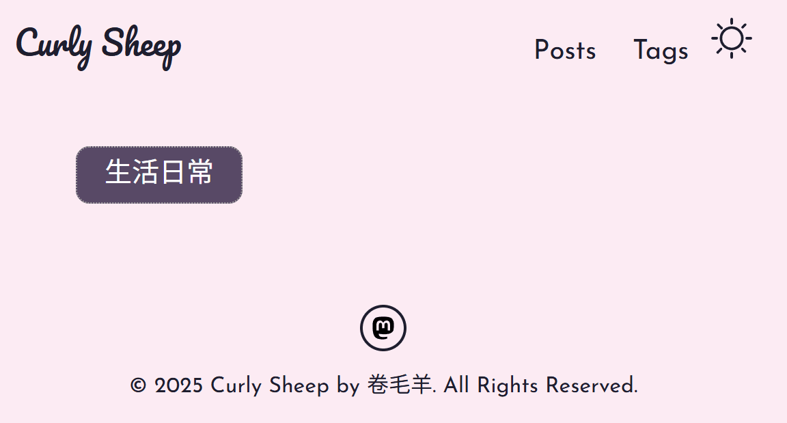
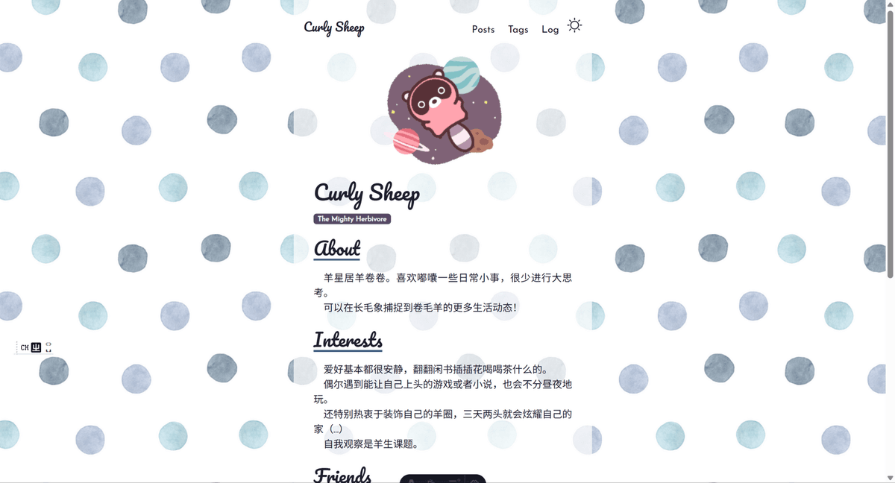
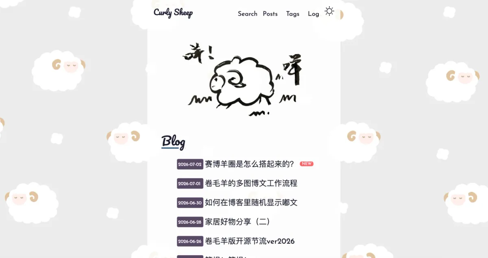

<p class='foreword my-3'>忙装修忙了这么久，写篇文说说我都在忙活什么，为什么这么上头。或许大家可以从中获得一些装修灵感！当然审美超主观，大家酌情参考……</p>

<div class="divider mb-3 mx-auto"></div>


### 为什么这么爱装修？

与其说是爱装修，不如说我比较喜欢不断调整视觉设计和功能直到自己满意为止。以前当微信公众号秀米小编的时候可能更偏向前者，后面进公司前后接受过一点网页设计培训，一想到设计出来这个东西还要按照客户需求来不能放飞自我就有点头大，加上培训期间没有获得什么成就感，就老老实实收拾包袱去写码了，做别人设计好的现成的图。

装修的时候可能会想象出来一个理想访客，但事实上这个理想访客基本上等于我……不会考虑其他人其他背景。毕竟我感觉高强度看我博客的估计只有我，所以做起来基本上就是我看着顺眼，用着舒服就行，跟我对我家的态度差不多。做的过程中要是真正的访客也觉得不错，那可能只是英雄所见略同……

但话又说回来爱上装修也只是这段很短的时间而已！刚搭完博客的很长一段时间里，我心知有很多待完善的地方但还是置之不理，心想能用就行……由此可见羊的心情真是一个很捉摸不定的东西。

### 如何获取装修灵感？

最近我用到的其实也就这几条：

* 去友链或者其他人的博客采风，看有没有什么可以借鉴的地方
* 逼问AI有没有什么更好玩的想法（比如最近加的阅读进度条和标签页离开前后变化就属于这类）
* 假装自己是个初次误入这个博客的人，到处点击博客各个地方，思考可能会在哪些地方觉得不便或者想要退出

### 装修的角度有哪些？

#### 1. 视觉设计

* 字体

字体我基本上都是沿用模板的，网站名和首页各个板块的标题的英文用Pacifico，其余诸如菜单等的英文用Josefin Sans，都可以在Google Fonts上搜到。

一开始是在线的，但是lighthouse测出来性能会被拖累，于是我就改成了本地的。

中文字体的话就是最普通的黑体，每个设备可能有点略微的不一样。打算这阵子有时间也研究研究，看看有没有什么更好看的字体（虽然觉得黑体跟我的博客也已经很搭了）。

* 背景图

我很长一段时间里用的都是模板自带的粉色背景色。



后面在booth.pm用“パターン”这个关键词搜到了水玉模样的花纹，觉得还不错就换上了。



最近新换的小羊背景图也是在这个网站用同样方法找到的，这类柄图感觉就很适合做博客背景图，我个人会喜欢相对稀疏的花纹胜过密集的，一个是主观上觉得更好看，二个是密集花纹容易分散注意力，让人忽视正文的内容。当然这也不是绝对的，只是说从我博客的版式出发，如果背景图展示面积比较小的话，用相对密集的花纹感觉也是个不错的选择。



夜间模式的背景图我也做了一些处理，换成了深色的，免得浅色背景图在电脑端上看太过刺眼。

噢对，之前还是水玉纹样背景的时候，我设置的是背景图随着一起滚动，后面评论有读者反馈说容易看了眼花，我心想的确如此，于是就改成了像现在这样固定的样子，同时调高了正文部分背景的不透明度，看起来应该会比之前要舒服不少。

* Main Visual

就是首页第一眼能看到的那个图啦！本来我约了我头像的那个像素小羊之后，也想着把博客装修一下，约了个小羊的gif动图的，可惜效果有点不太满意，就没有放上来，还是沿用了一阵子模板自带的应该是小浣熊的动图……？

现在这个是我师妹奶茶鼠几年前的作品！本来是画在我家白板上的，前一阵子翻相册看到觉得咦好像可以用到博客上来，于是就抠了图放了上来，果然很可爱！赞美奶茶鼠！

* 配色方案

文字和标签配色我基本上是沿袭模板自带的配色，没有做出过什么大的改动。

唯一比较多的改动可能是将原来粉色的背景色换成了自己挑的背景图，然后网页内容部分的背景色换成了浅色，（如果需要的话，是`rgba(255, 255, 255, 0.867)`），以便跟背景图相统一，看上去也更加简洁。深色模式的背景色依旧沿袭原来的。

#### 2. 排版与布局

* 整体架构

可以看到我的博客也就这几个页面：首页，Posts是按时间降序排列的博文目录，Tags是按标签分类的博文聚合页，Log是装修日志。没有单独设关于页和友链页，因为首页信息不多，基本上都放到那里去了。最近导航新加了Search这个站内搜索功能，不过是在当前页显示窗口，所以不算单独的一个页面。

友链/Posts页面的博文/Tags页面的博文/Logs页面的装修日志还有最近新加的Misskey动态基本上都换成了卡片式，虽然有些设计并不完全一样，动画效果也有点差别，但相比之前来说，视觉上应该会显得比较统一。Tags这个标签的显示还稍微有点突兀，可能后期会考虑怎么改吧。

除此之外我感觉让人知道我目前正处在哪个位置也很重要，AI给我推荐了面包屑导航，不过我感觉我的页面结构相对来说比较简单。于是现在打算做的一件事是，当处在某个页面时，菜单上那个页面的导航会固定出现下划线标志，这个功能好像现在如有，就是有点时灵时不灵的，可能还得回去研究一下。

* 页面内部的排版

模板自带的就是单栏布局，即内容居中，左右留白，说是视线不需要左右跳跃，阅读效率会比较高。我之所以沿袭单纯是觉得这样看起来比较清爽，不过最近是有在考虑把文章篇首的目录放到正文侧边栏，电脑端点起来应该会比较方便，手机端的话要怎么做我还没想好，毕竟现在导航也已经满满当当的了……

正文容器的最大宽度也是沿袭了模板设置为600px，大概一行会显示20个汉字左右。最近fedi上有友发排版相关的大博客，看了那个之后也想试着调一下，所以后面可能还会有变动。

对齐的话我没有做得很严格，单篇博文页的标签/目录块/文章块的首行/标题大概目视过去勉强算是对齐的就行。图片本来如果撑满的话可能也会显得更加齐整一些，不过我不是很喜欢突然就冒出来大图片怼脸，所以就固定死了图片的宽度是300px（手机上是200px），并且添加了图片放大功能作为补充。

标题层级的话，文章标题我是设置为h2，1.5rem(36px)，无装饰。文章内只有h3和h4两级标题有设计，我最多也就只用到这里了，不是那种很喜欢细分的人……h3的话，是1.15rem(27.6px)，前后空一个字符的空白，然后左边有线条装饰。h4则是1rem（24px），其余参数同h3。

行间距是1.5（36px），段落间距是24px，视觉上看段落间距要略大，加上首行缩进1字符，相对来说应该比较好区分新段落。

* 屏幕自适应

这也是受益于原模板的一个地方，自适应的大框架作者已经给我搭好了，我只要负责我魔改的那部分就可以了。做得最多的改动无非是像友链那样双栏改单栏，左右布局变成上下布局，如果文字被挤到一块的话就适当换行或者wrap，控制小屏幕上的显示数量。

* 屏幕长度与分页

单篇博文不建议分页，推荐目录跳转(锚点导航)，个人感觉分页更适合博文列表页。

#### 3. 阅读体验

* 文章字数统计、预计阅读时间

我可能有点急性子，看小说或者看书会经常先跳到目录看后面还有多少……所以一开始就在单篇博文的上方装了文章字数统计和预计阅读时间，感觉事先知道这个内心的焦躁会减轻很多，而且也方便自己知道是现在看还是之后再看。

* 阅读进度条

跟上面是类似的发明，不过这个是显示在单篇博文的顶部，方便阅读中了解自己看到哪个部分了，大概还剩多少。

* 链接跳转

基本上遵循博客内连接的话页内跳转，外部链接的话打开新标签页跳转的原则。

* 图片懒加载(lazy load)
 
多图博文适用，读到哪加载到哪，避免长文一次性加载所有图片。

* 图片点击放大

难得想要跟大家分享的图片怎么只能让人看一小块！而且也不方便我自己欣赏……具体方法在[卷毛羊的多图博文工作流程](../post-36.md)里面有介绍！

* 代码块一键复制

适用于各种使用到代码的教程！一键复制真的比手动全部选中再ctrl c方便很多……呜呜呜呜求各位写教程的菩萨都能顺手装一个。

####  4. 动线引导

* 回到首页按钮

其他页面还好，单篇博文较长加上导航在页面最顶部不跟着一起滚动的话还挺需要的……我的博客现在改成下滑会隐藏顶部菜单栏，上滑的时候才会显示，可以一键回到博客首页或者目录页，不用再点回到首页按钮再点击相应的按键连按两次。不过考虑到可能有友友想要返回顶部查看目录，所以回到首页按钮暂时还是保留了。

* 单篇博文的末尾的上一篇 / 下一篇

我也不知道是谁在用这个功能……也考虑过要不要改成相同主题的推荐，但这也还只是停留在想法阶段。总之现阶段文章读到最后的话再按回到首页按钮-点击博文目录页-从目录页挑选文章会稍微有点麻烦，所以想着最后还是放点文章链接，方便想看随便什么别的的读者。

* 文章顶部标题下方的分类标签

嗯对我的单篇博文一开始就有标分类的，点击那个分类就可以进去看相同主题的文章了！虽然不是很起眼，但可能也有用吧。

* Tag 页分类

为相同主题类的博文单独开的页面，进去点击标签就可查看相同分类的文章。最近改成了按文章数量降序排列，又细化了一下分类，应该比之前都扔在一两个分类下的时候要好很多。文章排序的话感觉可以考虑时间升序降序/数量升序降序/音序，我是比较希望能展示出自己最近写的/写得比较多的文章，所以Posts界面按时间降序，Tags界面按文章数量降序排列！
    
* 站内搜索功能

本来我以为不太会有人用的，收到了夏夏回复说她会用！加上克老师说这个装起来很容易，我又有点懒得弄索引，于是就直接装了个pagefind站内搜索。中文分词有点差强人意，不过也勉强可以用。

#### 5. 互动功能

* 评论系统

装了waline！最近才学会自定义评论区文字……不过其实fedi的嘟嘟发布也完全够用，之所以装了评论区纯粹是想打捞一些陌生友友，还有一些想要匿名留言的友友。

* 点赞

这部分基本上都是问克老师写的，用 Netlify Functions解决了！虽然我也不知道是怎么解决的哈哈……但是做起来感觉还是很容易的，不同的博客用到的工具可能不太一样，建议咨询一下AI老师！

* RSS 订阅

不确定有没有人会用（好像小鸟会用？）但总之先装上了……一开始好像还用不了，收到了小鸟的报错，问完AI修了一下就好了，也没太弄清楚原理就不班门弄斧了……！

#### 6. 有趣的小惊喜

* 动画效果(尤其按钮类)

这也是我最近在忙的装修内容，鼠标上移到对应按钮还好，hover的效果我基本上都有写了，但是手机端触碰点击的话就没有什么反馈，加上页面跳转可能需要个几秒，经常会让我自己误认为没点上或者是怎样……后面把触摸反馈加上了，其他动画效果也一起修改了，相对来说体验应该会好一些。

如果不清楚自己想要什么动画效果的话，也可以网上搜搜看，有很多那种展示效果和提供代码复制的网站，比如我随便搜出来的[studio.motion](https://studio-motion.com/)，[uiverse](https://uiverse.io/)。

* Favicon

favicon就是博客标签页左边显示的那个小图标，使用方法也很简单，在全局加载的head里面加上下面这样一行代码就可以。路径和文件换成自己想要改成的图片。

```html
<link rel="icon" href="/images/favicon.ico" />
```

* 离开当前页后标签页标题变化

这个也是放到全局加载的head里面就可以，在离开博客标签页的时候，显示自己自定义的文字。代码如下：

```html
<script>
  const originalTitle = document.title;
  const awayTitle = "(つ•̀ω•́)つ 等你回来~";

  document.addEventListener("visibilitychange", () => {
    if (document.hidden) {
      document.title = awayTitle;
    } else {
      document.title = originalTitle;
    }
  });
</script>
```

* 随机抓取最近的嘟文动态

感觉做大博客的Fedi友们或许会需要！具体效果参考我博客首页的星屑动态卡片，基本上是抓取最近的30条嘟嘟然后随机显示其中一条，一开始表情没有render，后面把表情也加上了，那篇博文在这里：[如何在博客里随机显示嘟文](../post-35.md)

* 博客搭建时间和全部文章字数统计

是看到友链里大家统计了，觉得这个很有纪念意义！于是自己也做了一个！代码如下：

```js
// 拿到所有文章
const posts = await getCollection('posts');


// 统计字数的工具函数
function getWordCount(content: string, options?: { onlyChinese?: boolean }): number {
  if (options?.onlyChinese) {
    const match = content.match(/[\u4e00-\u9fa5]/g);
    return match ? match.length : 0;
  } else {
    const plainText = content.replace(/[#*_>`~\-!\[\]\(\)>\n\r]/g, "").replace(/\s+/g, "");
    return plainText.length;
  }
}

// 计算总字数（复用你已有的 getWordCount 工具函数）
const totalWordCount = posts.reduce((sum, post) => {
  return sum + getWordCount(post.body, { onlyChinese: true });
}, 0);

// 设定博客搭建日期（因为我最早一片博文的发布日期跟搭建日期不一样，所以是写死了日期）
const earliestDate = new Date(2025, 4, 9);

// 字数转换成"千字"为单位，保留一位小数
const wordCountInThousands = (totalWordCount / 1000).toFixed(1);

// 在客户端运行的脚本
const start = new Date(earliestDate);
const now = new Date();

// 计算从最早那篇文章到今天，一共多少天
const diff = Math.floor((now - start) / (1000 * 60 * 60 * 24));
document.getElementById('days-count').innerText = diff;
```

最后再把变量填入想显示的文字部分就好了，这部分的html代码大概长这样：

```html
<p class="footer-stats">
  卷毛羊<del>登基</del>圈地已经 <span id="days-count">0</span> 天，<br/>咩咩了 {wordCountInThousands} 千字的废话
</p>
```

#### 7. 性能与加载速度

* 删除不用的文件和代码

原来模板自带了一些代码和页面，我没有再用到也没有去处理，近期才把这些整理了一下删掉了。

* 共通部分组件化

像是MV图/博文卡片/分页跳转等在一个页面以上使用的部分基本都组件化了，方便复用和修改，后续可能也会让AI帮我看看还有哪里可以组件化的部分，也一起修了。

* 压缩图片，减少体积
* 图片格式换成 webp(用 sharp 做批量转换流水线)

这两点都详见我之前发过的[卷毛羊的多图博文工作流程](../post-36.md)！因为有很多照片是直接从手机上下下来的，体积很大加载起来很慢，所以统一都压缩了！现在看起来应该会快很多。

* SPA / 局部刷新体验

这个是我之前一直没有用上的astro路由……导致我的博客很长一段时间里点开新的链接都要重新刷新一遍，可以看到从空白到页面加载出来的频闪，现在的话点击卷毛羊博客的各个部分，应该可以看到页面切换时候的频闪消失了，加载也更加丝滑了！

#### 8. 分享

* OG 卡片

主要是分享到长毛象/Mastodon 等平台时显示对应图片、标题、描述。原来模板好像就自带了，不过因为某些原因只显示了标题，没有显示文章的简介，最近才稍微修了一下，又测试了一遍，现在分享博文的时候应该能看到单篇文章的简介了。如果需要的话这是代码，网上也应该能找到，复制过去放到全局都会加载的head里面然后再改改或者问问AI再自定义一下就行！


```html
    <!-- Open Graph （分享到 Misskey / 长毛象等联邦宇宙时用于生成预览卡片） -->
    <meta property="og:type" content={type} />
    <meta property="og:site_name" content="Curly Sheep" />
    <meta property="og:title" content={pageTitle} />
    <meta property="og:description" content={description} />
    <meta property="og:url" content={pageURL} />
    <meta property="og:image" content={ogImageURL} />
    <meta property="og:locale" content="zh_CN" />
```

<div class="divider my-3 mx-auto"></div>
<p class='foreword'>感觉越写发现我想要装修的地方就越多……大博客真的是个无底洞啊太可怕了……</p>
