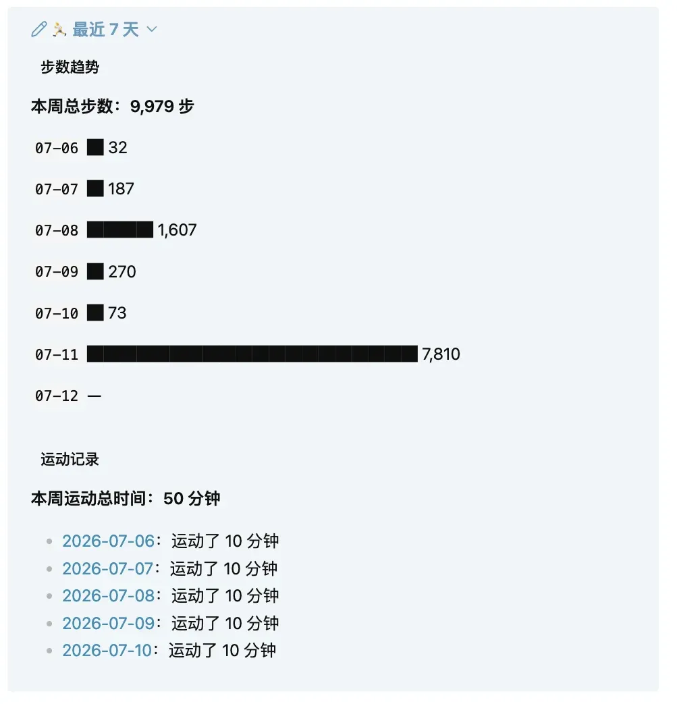
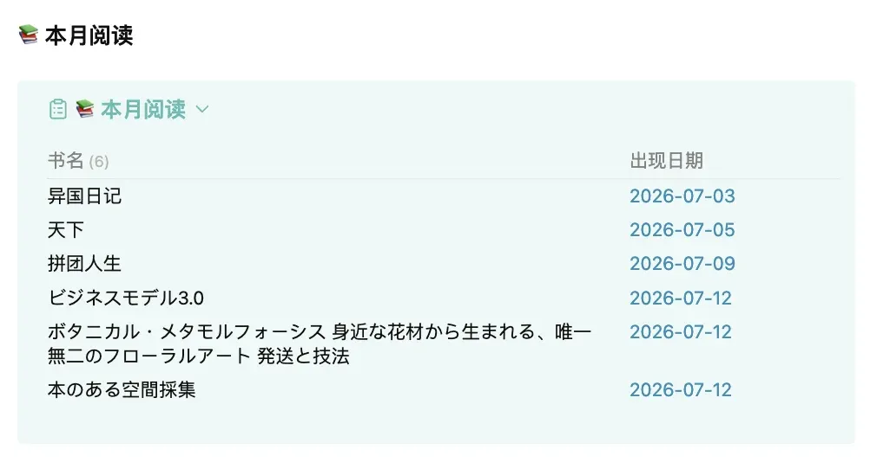
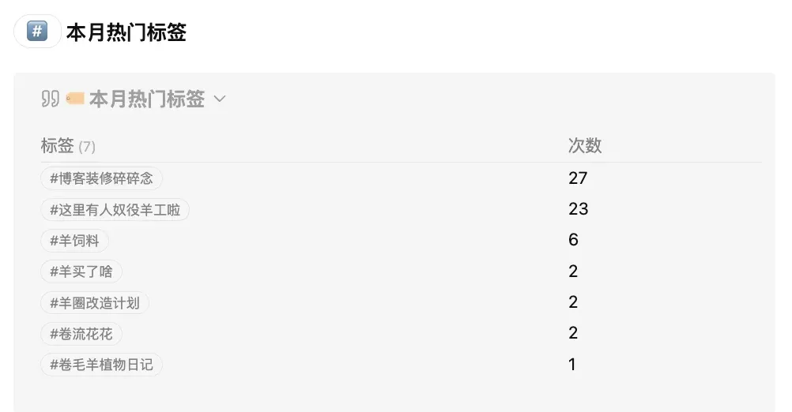
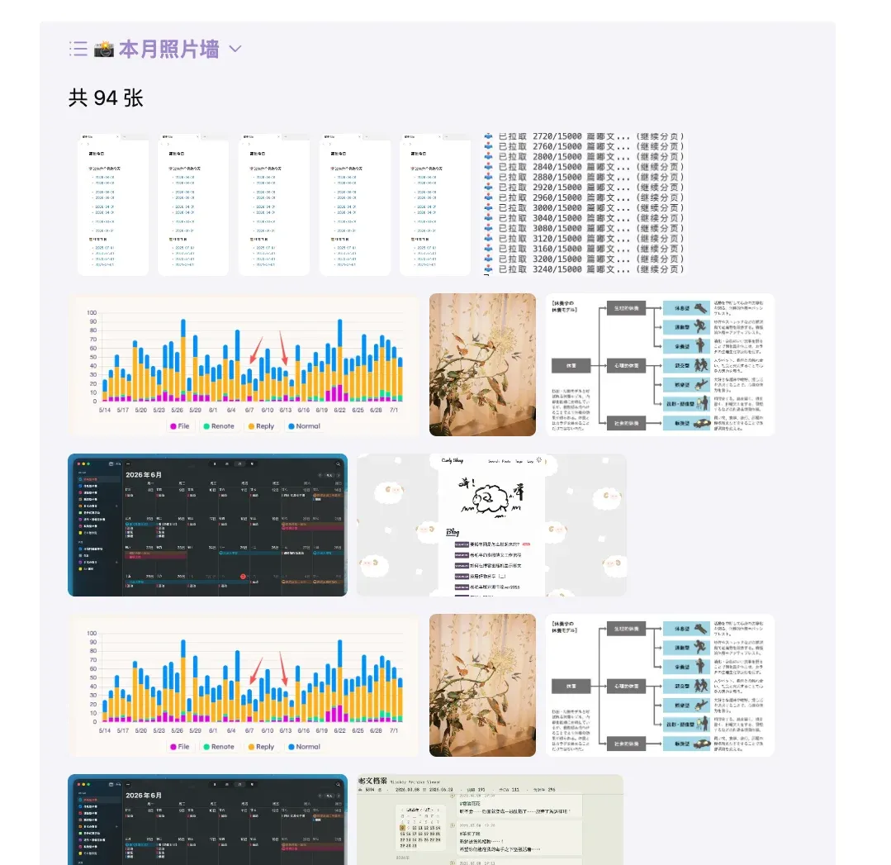
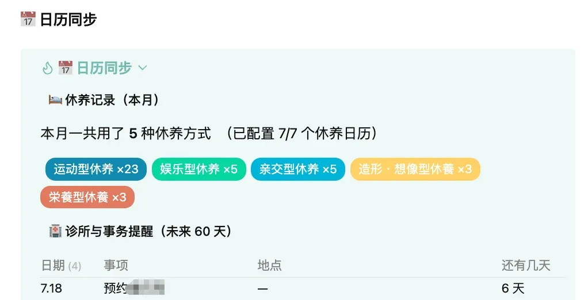

<p class='foreword my-3'>以为忙完大博客装修后就无事可忙了，没想到又让我找到了新的电子玩具……我的obsidian手帐！于是又来跟大家分享我新鲜忙完的成果了。</p>

<div class="divider mb-3 mx-auto"></div>

起因其实是我发了条嘟嘟感慨自己记录的工具太多：

<iframe src="https://stelpolva.moe/embed/notes/ao5a6ij6h8om1ac5" data-misskey-embed-id="v1_10999527-2255-440e-b09c-91b88b026997" loading="lazy" referrerpolicy="strict-origin-when-cross-origin" style="border: none; width: 100%; max-width: 500px; height: 300px; color-scheme: light dark;margin: 0 auto 30px;"></iframe>
<script defer src="https://stelpolva.moe/embed.js"></script>

然后就收获了热心塔塔的回复，说自己把毛象内容/账本内容/日历信息汇总到了obsidian上，还给我指路了自己的文章：[玩具箱 | 个人大生活家三件套之2026篇](https://mantyke.icu/posts/2026/toybox6/)。然后当天晚上我就开始研究起了塔塔博客里分享的那个脚本，成功把自己两个毛象号一个misskey号的嘟嘟都塞进了obsidian日记里，就此开始了折腾我的obsidian……！

### 嘟文合并到日记

毛象版的嘟文抓取脚本，用塔塔博客里分享的那个已经很完美了，我也是直接下下来按照塔塔教的方法用了！星屑账号的嘟文抓取，我让克老师给我改了个Misskey能用的版本，因为代码太长折叠了，大家需要的话可以点开下面的三角符号展开内容然后复制，保存的时候存成.py后缀就可以。还让克老师给我写了尽可能详细的注释，供大家参考！

<details>
<summary class="mb-5">Misskey（星屑）嘟文合并到obsidian脚本</summary>

```python
"""
======================================================================
Misskey 嘟文自动抓取进 Obsidian —— 详细注释版
======================================================================

这个脚本做的事情很简单：
1. 用你的 Misskey API Token 登录你的账号；
2. 拉取你发过的嘟文（notes）；
3. 按"发布日期"把这些嘟文整理成 Markdown 格式；
4. 写进你 Obsidian 库里对应日期的 Day Planner 日记文件里；
5. 记录已经同步过的嘟文 ID，避免下次重复写入。

依赖的第三方库（运行前需要先安装）：
    pip install Misskey.py html2text

    - Misskey.py：Python 版 Misskey API 客户端，负责和 Misskey 实例通信。
    - html2text：脚本里 import 了但其实当前代码没有直接调用它的函数，
      如果你后续想把 note 里的 HTML 内容转成纯文本/Markdown，可以用它。
      如果你不需要，也可以把这行 import 删掉。

运行前你必须做的事情（对应下面 CONFIG 里的空字符串）：
    1. instance_url  —— 你所在 Misskey 实例的网址，例如 "https://misskey.io/"
                         注意：结尾一定要带斜杠 "/"。
    2. api_token     —— 你的 Misskey API 密钥（下面"如何获取 Token"会讲）。
    3. vault_path    —— 你的 Obsidian 仓库（vault）在电脑上的绝对路径。
    4. day_planner_dir —— 在 vault_path 之下，存放"每日日记"文件的子目录，
                          例如 "000-活着/Day Planners"。

======================================================================
【如何获取 Misskey API Token】
======================================================================
1. 登录你的 Misskey 实例网页版；
2. 进入 "设置"（Settings）→ "API"（一般在"其他"或个人资料相关菜单里）；
3. 创建一个新的 App / Access Token；
4. 权限（permission）至少要勾选"读取账号信息"和"读取笔记"相关的权限
   （不同 Misskey 版本命名略有差异，勾"账号信息读取"+"笔记读取"即可，
   不需要给发布/删除等写权限，脚本只读取，不发帖）；
5. 生成后会得到一串类似 "6wA5VJ..." 的字符串，这就是 api_token，
   复制粘贴进 CONFIG 里。

⚠️ 安全提醒：这个 Token 相当于你账号的半个钥匙，不要把它提交到公开的
   Git 仓库或者发进博客截图里。如果你要写博客分享这个脚本，请务必把
   CONFIG 里的真实 Token、instance_url、vault_path 都替换/打码掉，
   或者建议读者用环境变量、单独的 config.json（并加进 .gitignore）来存放。

======================================================================
【运行前还需要准备的 Obsidian 侧文件】
======================================================================
- 在 day_planner_dir 目录下，需要有一个名为
  "Daily note模板.md" 的模板文件。当某一天还没有日记文件时，
  脚本会读取这个模板作为新文件的"骨架"，再把嘟文追加进去。
  如果你的模板文件名不同，记得把 load_daily_template() 里的
  文件名一起改掉，或者改成和你自己模板同名。
- 日记文件按 "YYYY-MM-DD.md" 命名（比如 "2026-07-13.md"），
  可以放在 day_planner_dir 根目录，也可以放在其下的年/月子文件夹里，
  脚本会自动递归查找。

======================================================================
"""

import os
import sys

# ----------------------------------------------------------------------
# 调试日志重定向
# ----------------------------------------------------------------------
# 把脚本运行时所有的 print() 输出、以及报错信息，都写进一个日志文件，
# 而不是打印在终端里。这在你把脚本交给"定时任务"（比如 macOS 的
# launchd、Windows 的计划任务、群晖 NAS 的计划任务等）自动运行时特别有用——
# 因为定时任务通常看不到终端输出，出了问题只能靠这个日志文件排查。
#
# 日志文件位置：脚本所在目录的"上一级目录"下的 misskey_debug.log。
# 如果你想让日志和脚本放在同一目录，把下面这行的 ".." 删掉即可。
_debug_log_path = os.path.join(os.path.dirname(os.path.abspath(__file__)), "..", "misskey_debug.log")
sys.stdout = open(_debug_log_path, 'a')  # 'a' = 追加模式，不会覆盖之前的日志
sys.stderr = open(_debug_log_path, 'a')
print("--- 脚本启动检查 ---")

from datetime import datetime, timezone
from misskey import Misskey   # 第三方库：pip install Misskey.py
import html2text              # 第三方库：pip install html2text（当前代码未直接用到，可选）

# ======================================================================
# 🎯 配置区域（读者最需要关注、必须修改的地方）
# ======================================================================
CONFIG = {
    # 你的 Misskey 实例地址，必须以 "/" 结尾
    "instance_url": "",        # 例：  "https://misskey.io/"

    # 你的 Misskey API Token（获取方法见文件顶部说明）
    "api_token": "",           # 例：  "xxxxxxxxxxxxxxxxxxxxxxxxxxxxxxxx"

    # 你的 Obsidian 仓库在本地的绝对路径
    "vault_path": "",          # 例：  "/Users/yourname/Documents/MyVault"

    # vault_path 下面，存放"每日日记"的子目录
    "day_planner_dir": "",     # 例：  "000-Life/Day Planners"

    # 以下这些一般不需要改，除非你想自定义格式/行为：

    # 写入日记文件时，用来标记"这一块是 Misskey 日志"的二级标题
    "target_header": "## 📝 Misskey 日志",

    # Obsidian 的 callout（高亮引用框）语法，"+" 表示默认展开
    # 想了解更多可搜索 "Obsidian callout"
    "callout_open": "> [!quote]+",

    # 每次运行最多拉取多少条嘟文（用于分页拉取的总量上限）
    "pull_limit": 100,

    # 每一页（每次 API 请求）拉取多少条，Misskey 单次请求上限通常是 100
    "posts_per_page": 100,

    # 日期文件名的格式，对应 Python strftime 格式，默认是 "2026-07-13"
    "date_format": "%Y-%m-%d",

    # 用来记录"已经同步过的嘟文 ID"的文件名，会存放在 vault_path 根目录下
    # 这个文件保证脚本可以反复运行而不会把同一条嘟文重复写入日记
    "id_file_name": "misskey_synced_ids.txt"
}


# ======================================================================
# ID 文件管理：负责"哪些嘟文已经同步过了"
# ======================================================================
def load_synced_ids(full_path: str) -> set:
    """读取"已同步 ID 记录文件"，返回一个 ID 集合。
    如果文件还不存在（第一次运行），就返回空集合。"""
    if not os.path.exists(full_path): return set()
    with open(full_path, 'r', encoding='utf-8') as f:
        return {line.strip() for line in f if line.strip()}

def append_new_ids(full_path: str, new_ids: list[str]):
    """把这一轮新同步的嘟文 ID，追加写入记录文件末尾。
    如果目录不存在会自动创建。"""
    if not new_ids: return
    os.makedirs(os.path.dirname(full_path), exist_ok=True)
    with open(full_path, 'a', encoding='utf-8') as f:
        for post_id in new_ids: f.write(f"{post_id}\n")


# ======================================================================
# Day Planner 文件定位：找到"某一天的日记文件"具体在哪
# ======================================================================
def find_day_planner_path(vault_path: str, day_planner_dir: str, date_str: str) -> str:
    """在 Day Planners 目录下递归查找 {date_str}.md；
    找到就返回其实际路径（可能在年/月子文件夹里，比如按年份分文件夹归档）；
    找不到（说明当天日记还没建立/归档）时，返回 Day Planners 根目录下的默认路径，
    后续 write_to_obsidian_journal() 会在这个路径新建文件。"""
    root_dir = os.path.join(vault_path, day_planner_dir)
    for dirpath, _, filenames in os.walk(root_dir):
        if f"{date_str}.md" in filenames:
            return os.path.join(dirpath, f"{date_str}.md")
    return os.path.join(root_dir, f"{date_str}.md")

def load_daily_template(vault_path: str, day_planner_dir: str) -> str:
    """读取"每日日记"的模板文件内容。
    ⚠️ 读者注意：这里写死了模板文件名叫 "Daily note模板.md"，
    如果你自己的 Obsidian 模板文件名不一样，记得改这里的字符串。"""
    template_path = os.path.join(vault_path, day_planner_dir, "Daily note模板.md")
    with open(template_path, "r", encoding="utf-8") as f:
        return f.read()


# ======================================================================
# 内容格式化：把一条 Misskey 嘟文，转换成 Obsidian 里好看的 Markdown
# ======================================================================
def format_note_to_md(note: dict) -> str:
    """
    输入：Misskey API 返回的一条 note（字典，包含 createdAt / text / files / id 等字段）
    输出：一段 Markdown 文本，形如：

        > - **14:32:10**
        > 	- 今天天气不错
        >     - [笔记地址](https://xxx/notes/abc123)
        >     - 

    这段文本最终会被塞进 Obsidian 的 callout 引用框里。
    """
    # --- 时间转换 ---
    # Misskey 返回的时间是 UTC，格式类似 "2026-07-13T06:32:10.000Z"
    # 这里先解析成带时区信息的 datetime，再转换成"本机系统所在时区"的本地时间
    created_at = datetime.fromisoformat(note['createdAt'].replace('Z', '+00:00'))
    created_at = created_at.astimezone(datetime.now(timezone.utc).astimezone().tzinfo)
    time_str = created_at.strftime('%H:%M:%S')  # 只保留"时:分:秒"，日期由文件名决定

    # --- 正文处理 ---
    content = note.get('text', '') or ''  # 有些嘟文可能没有文字（纯图片），做个空值兜底
    # 把正文按行拆开，过滤掉空行，每一行前面加上 "> \t- " 做成 Obsidian 的
    # "引用框 + 缩进列表项" 格式
    indented_content = "".join([f"> \t- {line}\n" for line in content.split('\n') if line.strip()])

    # 拼出这条嘟文在网页上的原始链接，方便以后点回去看上下文/评论
    note_url = f"{CONFIG['instance_url'].rstrip('/')}/notes/{note['id']}"

    # 组装最终的 Markdown 块：时间加粗 + 缩进正文 + 原文链接
    markdown = f"> - **{time_str}**\n{indented_content.rstrip()}\n>     - [笔记地址]({note_url})"

    # --- 附件（图片/视频等）处理 ---
    if note.get('files'):
        # Markdown 里图片语法是 ""，开头的 "!" 是关键，
        # 有了它 Obsidian 才会把图片直接内嵌显示出来，而不是显示成一个普通链接
        media_links = [f"})" for f in note['files']]
        markdown += f"\n>     - {', '.join(media_links)}"
    return markdown


# ======================================================================
# 写入逻辑：把整理好的嘟文，插入到对应日期的日记文件里
# ======================================================================
def write_to_obsidian_journal(full_path, target_header, callout_open, post_contents_map, file_date_str, template_content):
    """
    这个函数处理三种情况：
    情况一：这一天的日记文件根本不存在 —— 用模板新建一个，
            末尾追加"## 📝 Misskey 日志"标题 + callout 框 + 嘟文内容。
    情况二：日记文件存在，但里面还没有"## 📝 Misskey 日志"这个标题 ——
            在文件末尾补上标题 + callout 框 + 内容。
    情况三：文件里已经有这个标题 ——
            进一步判断标题下面是否已经是一个 callout 引用框：
              - 如果是，就把新嘟文插进这个 callout 框的最前面（保持时间顺序）；
              - 如果不是（说明是脚本升级前、旧版本写入的内容，没有套 callout 框），
                就在标题下面补一行新的 callout 开头，再插入新内容；
                旧内容不会被回溯改格式，留在 callout 框外面。
    """
    # 把这一天所有新嘟文的 Markdown 片段，用换行拼接成一整段
    new_posts_content = "\n".join(post_contents_map) + "\n"

    # --- 情况一：文件不存在，全新创建 ---
    if not os.path.exists(full_path):
        os.makedirs(os.path.dirname(full_path), exist_ok=True)
        body = template_content.strip("\n")
        with open(full_path, 'w', encoding='utf-8') as f:
            f.write(f"{body}\n\n{target_header}\n\n{callout_open}\n{new_posts_content}")
        return

    # --- 文件已存在，读出全部内容以便定位插入点 ---
    with open(full_path, 'r+', encoding='utf-8') as f:
        content = f.read()
        header_index = content.find(target_header)

        # --- 情况二：文件里连"## 📝 Misskey 日志"标题都没有 ---
        if header_index == -1:
            f.seek(0, 2)  # 移动到文件末尾
            f.write(f"\n\n{target_header}\n\n{callout_open}\n{new_posts_content}")
            return

        # --- 情况三：标题存在，检查标题正下方是不是已经有 callout 开头这一行 ---
        after_header = content[header_index + len(target_header):]
        if after_header.lstrip("\n").startswith(callout_open):
            # 已经是 callout 格式：找到 callout 开头行的下一行，把新内容插进去
            co_index = content.find(callout_open, header_index)
            insert_point = content.find('\n', co_index) + 1
            new_content = content[:insert_point] + new_posts_content.rstrip() + "\n" + content[insert_point:]
        else:
            # 旧格式文件：标题下面还没套 callout，这次运行补一行 callout 开头，
            # 之前已经写过的旧内容留在 callout 框外，不做回溯改格式
            insert_point = content.find('\n', header_index) + 1
            new_content = (
                content[:insert_point]
                + "\n" + callout_open + "\n"
                + new_posts_content.rstrip() + "\n"
                + content[insert_point:]
            )
        # 把游标移回文件开头，写入更新后的全部内容，并截断掉多余的旧内容
        f.seek(0); f.write(new_content.strip() + "\n"); f.truncate()


# ======================================================================
# 主逻辑：串联起"登录 → 拉取 → 整理 → 写入 → 记录"这一整套流程
# ======================================================================
def main():
    # --- 第一步：用 Token 登录，确认是哪个账号 ---
    mk = Misskey(address=CONFIG["instance_url"].rstrip('/'), i=CONFIG["api_token"])
    me = mk.i()  # 调用 Misskey 的 "i" 接口，返回当前登录用户自己的信息
    user_id = me['id']
    print(f"👤 已连接用户: {me['username']}")

    # --- 第二步：读取"已同步过的嘟文 ID"列表，避免重复写入 ---
    id_file_path = os.path.join(CONFIG["vault_path"], CONFIG["id_file_name"])
    existing_ids = load_synced_ids(id_file_path)

    # --- 第三步：分页拉取嘟文，直到达到 pull_limit 或没有更多数据 ---
    all_notes = []
    until_id = None  # Misskey 的分页方式：每次传入"上一页最后一条的 ID"，从它之前继续拉取

    print("📥 正在从 Misskey 拉取笔记...")
    while len(all_notes) < CONFIG["pull_limit"]:
        notes = mk.users_notes(
            user_id=user_id,
            limit=CONFIG["posts_per_page"],
            until_id=until_id
        )
        if not notes: break  # 已经拉到底了，没有更多历史嘟文
        all_notes.extend(notes)
        until_id = notes[-1]['id']  # 更新分页游标，准备拉下一页
        print(f"进度: {len(all_notes)}...")

    # --- 第四步：按日期把新嘟文分组聚合 ---
    # aggregated 结构类似：{"2026-07-13": ["格式化后的嘟文1", "格式化后的嘟文2", ...], ...}
    aggregated = {}
    new_ids = []
    # reversed() 是为了让同一天内的嘟文按"从早到晚"的顺序处理和写入
    # （因为 Misskey 分页返回的通常是"从新到旧"）
    for note in reversed(all_notes):
        if note['id'] in existing_ids: continue  # 已经同步过的直接跳过，防止重复

        created_at_local = datetime.fromisoformat(note['createdAt'].replace('Z', '+00:00')).astimezone(datetime.now(timezone.utc).astimezone().tzinfo)
        date_str = created_at_local.strftime(CONFIG["date_format"])  # 按本地时区决定归到哪一天

        if date_str not in aggregated: aggregated[date_str] = []
        aggregated[date_str].append(format_note_to_md(note))
        new_ids.append(note['id'])
        existing_ids.add(note['id'])  # 同时更新内存中的集合，防止一次运行内的重复

    # --- 第五步：把每个日期聚合好的内容，写入对应的 Obsidian 日记文件 ---
    print(f"📝 准备写入 {len(aggregated)} 个日期的日志文件...")
    template_content = load_daily_template(CONFIG["vault_path"], CONFIG["day_planner_dir"])
    for date_key, posts in aggregated.items():
        full_path = find_day_planner_path(CONFIG["vault_path"], CONFIG["day_planner_dir"], date_key)
        write_to_obsidian_journal(full_path, CONFIG["target_header"], CONFIG["callout_open"], posts, date_key, template_content)
        print(f"✅ 已处理日期: {date_key}, 写入了 {len(posts)} 条笔记")

    # --- 第六步：把这一轮成功写入的嘟文 ID 记下来，供下次运行时去重 ---
    append_new_ids(id_file_path, new_ids)


if __name__ == "__main__":
    main()


# ======================================================================
# 【运行方式】
# ======================================================================
# 1. 确认 Python 环境已安装依赖：
#        pip install Misskey.py html2text
# 2. 把上面 CONFIG 里的 4 个空字符串都填好。
# 3. 命令行运行：
#        python misskeyObsdian_annotated.py
# 4. 第一次运行前，务必先去 CONFIG["vault_path"] 下确认
#    day_planner_dir 目录、以及 "Daily note模板.md" 模板文件已经存在，
#    否则会在 load_daily_template() 那一步报错（文件不存在）。
# 5. 如果想让脚本每天自动运行一次，可以用系统自带的定时任务工具：
#      - macOS: launchd（写一个 .plist）或者简单点用 `crontab -e` 加一行
#               定时命令
#      - Windows: "任务计划程序"（Task Scheduler）
#      - 群晖/威联通等 NAS: 控制面板里的"任务计划"
#    出问题时，去 vault_path 上一级目录下的 misskey_debug.log 里看报错信息。
# ======================================================================
```

</details>

然后每次手动执行脚本太麻烦，我又常常喜欢回看自己的嘟文，就又让克老师给我写了个自动执行的脚本。下面这个是Mac用的版本，windows的话大家可能需要再咨询一下AI看看有没有什么别的办法……！

<details>
<summary class="mb-5">Mac自动运行的脚本(后缀存成.plist)</summary>

```xml

<?xml version="1.0" encoding="UTF-8"?>
<!DOCTYPE plist PUBLIC "-//Apple//DTD PLIST 1.0//EN" "http://www.apple.com/DTDs/PropertyList-1.0.dtd">
<!--
======================================================================
launchd 配置文件 —— 让 Misskey 抓取脚本每天自动运行（macOS 专用）
======================================================================

这是什么：
    macOS 自带一个后台任务调度系统叫 launchd，它比 cron 更"原生"，
    是苹果官方推荐在 macOS 上做定时任务的方式。这份 .plist 文件
    就是喂给 launchd 的一份"任务说明书"：几点几分、运行哪个程序、
    用哪个 Python 解释器、日志写到哪里。

    效果：每天早上 8:00，自动帮你把 Misskey 上新发的嘟文抓取进
    Obsidian 日记里，不用自己手动跑脚本。

使用前必须替换的占位符（下面用 __尖括号__ 标出）：
    __USERNAME__      —— 你 Mac 的用户名（比如 /Users/你的用户名/...）
    __VENV_PATH__     —— 你为这个脚本创建的 Python 虚拟环境路径
    __SCRIPT_PATH__   —— misskeyObsdian.py 脚本所在的完整文件夹路径
    __LOG_PATH__      —— 你希望运行日志写到哪个文件

⚠️ 关于"虚拟环境"：
    ProgramArguments 里第一行没有直接写 "python3"，而是写了一个
    虚拟环境（venv）里的 python3 可执行文件的完整路径。这是因为
    launchd 启动程序时，不会像你在终端里那样自动加载你的 shell
    配置（.zshrc/.bash_profile），也就找不到你 pip install 过的
    Misskey.py 等第三方库。直接指向虚拟环境里的 python3，可以确保
    这些依赖库一定能被找到。
    如果你还没建虚拟环境，可以这样建一个（在脚本所在目录下执行）：
        python3 -m venv .venv
        source .venv/bin/activate
        pip install Misskey.py html2text
    建好之后，虚拟环境里的 python3 路径通常就是：
        <脚本所在目录>/.venv/bin/python3

======================================================================
-->
<plist version="1.0">
<dict>
    <!-- Label：这个任务的唯一标识名，习惯上用"反向域名"风格命名，
         随便取一个不和别的任务重名的名字即可，比如
         com.yourname.misskey-sync -->
    <key>Label</key>
    <string>com.example.misskey-sync</string>

    <!-- ProgramArguments：要执行的命令，数组里第一项是可执行程序，
         之后是传给它的参数。这里等价于在终端里运行：
         /path/to/.venv/bin/python3 /path/to/misskeyObsdian.py -->
    <key>ProgramArguments</key>
    <array>
        <string>/Users/__USERNAME__/__VENV_PATH__/.venv/bin/python3</string>
        <string>/Users/__USERNAME__/__SCRIPT_PATH__/misskeyObsdian.py</string>
    </array>

    <!-- WorkingDirectory：脚本运行时的"当前工作目录"。
         保持和脚本所在文件夹一致就好，避免脚本里用到相对路径时出错 -->
    <key>WorkingDirectory</key>
    <string>/Users/__USERNAME__/__SCRIPT_PATH__</string>

    <!-- StartCalendarInterval：定时规则，这里表示"每天 8:00"运行一次。
         Hour 取值 0-23，Minute 取值 0-59。
         想改成每天中午 12:30，就把 Hour 改成 12、Minute 改成 30 -->
    <key>StartCalendarInterval</key>
    <dict>
        <key>Hour</key>
        <integer>8</integer>
        <key>Minute</key>
        <integer>0</integer>
    </dict>
    <key>StandardOutPath</key>
    <string>/Users/__USERNAME__/__SCRIPT_PATH__/sync.log</string>
    <key>StandardErrorPath</key>
    <string>/Users/__USERNAME__/__SCRIPT_PATH__/sync.log</string>

    <!-- RunAtLoad：true 表示每次"加载"这个任务时（比如电脑开机、
         或者你手动 launchctl load 一次）会立刻执行一次，
         不用等到第二天 8 点才第一次运行，方便你马上验证配置对不对 -->
    <key>RunAtLoad</key>
    <true/>
</dict>
</plist>

<!--
======================================================================
【安装 / 启用步骤】
======================================================================
1. 把上面的占位符都替换成你自己的真实路径，另存为一个 .plist 文件，
   文件名建议和 Label 保持一致，比如：
       com.yourname.misskey-sync.plist

2. 把这个文件放进 launchd 的用户级配置目录：
       ~/Library/LaunchAgents/
   如果这个目录不存在，先手动创建它。

3. 在终端里加载这个任务：
       launchctl load ~/Library/LaunchAgents/com.yourname.misskey-sync.plist

   （如果之前加载过、改了配置想重新加载，先卸载再加载：
       launchctl unload ~/Library/LaunchAgents/com.yourname.misskey-sync.plist
       launchctl load ~/Library/LaunchAgents/com.yourname.misskey-sync.plist   ）

4. 验证是否加载成功：
       launchctl list | grep misskey
   能看到对应的 Label 就说明 launchd 已经识别了这个任务。

5. 排查问题：
   - 先看 sync.log（脚本自己的标准输出/报错）；
   - 再看脚本内部重定向出来的 misskey_debug.log（脚本内部 print 的日志）；
   - 常见问题是路径写错、虚拟环境路径不对、或者 Mac 的"完全磁盘访问权限"
     没有给终端/launchd 访问 Obsidian 库所在磁盘位置的权限。
======================================================================
-->
```

</details>

这样我就解放双手了！我设置成了每天早上8点自动运行一次，抓取昨天的嘟文，还能顺便给嘟文备个份……美滋滋！

在把嘟嘟汇总到obsdian之后，怎样回顾也是一个问题。为了让之前的记录不会沉底，我做了一个“那年今日”的界面，方便我有心情的时候点进去看看几个月前或者几年前那天的我在做什么。本来也有插件可以实现的，但是我相同日期的记录散落在不同的文件夹，就还是让克老师给我手搓了一个，用到的是插件dataview，如果需要的话代码如下，装好插件打开js功能然后复制以下代码到页面里应该就可以了：

<details>
<summary class="mb-5">那年今日代码</summary>

> ```js
> const now = new Date();
> const currentMonth = now.getMonth() + 1;
> const currentDay = now.getDate();
> const currentYear = now.getFullYear();
>
> dv.header(4, "过去六个月的今天");
> let any6mo = false;
> for (let i = 1; i <= 6; i++) {
>     let d = new Date();
>     d.setMonth(now.getMonth() - i);
>     let target = `${d.getFullYear()}-${(d.getMonth() + 1).toString().padStart(2, '0')}-${d.getDate().toString().padStart(2, '0')}`;
>
>     let matches = dv.pages().where(p => p.file.name === target);
>     if (matches.length > 0) {
>         any6mo = true;
>         dv.list(matches.file.link);
>     }
> }
> if (!any6mo) dv.paragraph("（无匹配记录）");
>
> dv.header(4, "往年今日");
> const yearMatches = dv.pages()
>     .where(p => {
>         const match = p.file.name.match(/^(\d{4})-(\d{2})-(\d{2})$/);
>         if (!match) return false;
>         return parseInt(match[2]) === currentMonth &&
>                parseInt(match[3]) === currentDay &&
>                parseInt(match[1]) !== currentYear;
>     })
>     .sort(p => p.file.name, 'desc');
>
> if (yearMatches.length > 0) {
>     dv.list(yearMatches.map(p => p.file.link));
> } else {
>     dv.paragraph("（无匹配记录）");
> }
> ```

</details>

后续我又给obsdian做了个聚合页当作主页，这个那年今日也就挪到了里面去……不过代码还是不变！

### 记账数据插入日记

弄完嘟文之后，就开始研究记账数据怎么插入。记账这个动作还是打算用Cashew来完成，毕竟手机记录起来更方便，而且功能也更全面一点，数据填进obsidian的日记里纯粹是为了方便我对照看自己哪天有什么开销，花得是不是开心，月总结的时候是不是可以参考这些消费来进行一部分指出的回顾和总结（全放Cashew里我会忘记或者懒得打开）。

记账软件可以导出csv文件，让克老师给我插入之前先清洗了一下数据，因为有几百条对账产生的余额校正，不是真实消费，而且也还有一些订阅类的未来消费，不应该记入，这部分代码估计不同记账app的话不太一样，就不分享了。清洗后就直接让克老师把数据插入我原有的手帐记录里，指定插入的位置，在批量插入之前让他先拿一个文件给我示范一下效果，看看需不需要调整显示项目和排版，就这样把历史数据全部插入了手帐里！

清洗和插入克老师都写了脚本给我，但我还是嫌每次都要自己来一遍很麻烦，于是跟它讨论了一下怎么实现手机端cashew导出csv文件-发送文件到电脑-电脑收到指令自动运行脚本的这个流程自动化。结论是Cashew没有开放“用快捷指令触发导出”的借口（写着写着突然想到我现在用的是魔改版Cashew或许可以让克老师给我做一个），手机端的导出csv到电脑这几步仍要我手动执行，但是落地到Mac端的话可以实现全自动。

一开始商量的方案是存进iCloud云盘里，但好像效果不是很好，就换成了隔空投送，调试了几次之后终于跑通了。现在的流程大概就是我手机上手动导出csv选择隔空投送到电脑-Mac收到之后自动执行数据清洗和插入obsidian-完成后自动删除投送到电脑的文件。账本更新不需要太频繁，所以这点手动的工作我还算能忍……！

### 苹果健康数据插入到日记

以前其实在obsidian的日记里手动记过一阵子运动步数和生理期，但可能因为手动记起来实在太麻烦了，渐渐的就没有再记录了。这次想这是可以直接用手机苹果健康app上的记录，相对来说应该比较简单，所以又捣鼓了一阵。

首先做的是历史数据导出，健康app里面可以导出个zip然后像之前账单那样插入对应日期的手帐里，这部分没有什么难点，直接一步让克老师给我做好了，磨了比较久的是每天数据自动化同步到obsidian，克老师给我的步骤是这样的：

 * 打开 Shortcuts App → 自动化 → 新建"个人自动化" → 选"时间" → 设成每天固定时间（比如 23:55）→ 关掉"运行前询问"，这样才会真正在后台自动跑，不用你手动点。
* 添加动作 查找健康样本(Find Health Samples) → 类型选"步数"，日期范围设为"今天"。
* 后面接一个 计算统计信息(Calculate Statistics) → 统计类型选"总和"，得到当天步数总数。
* 再加一个 查找健康样本 → 这次找"经期流量"之类的分类（在 Health Sample 类型列表里找周期追踪相关的选项，具体名字以你手机上看到的为准），日期范围也设"今天"。
* 加一个「格式化日期」动作：输入用"当前日期"，格式设成 yyyy-MM-dd，方便后面当文件名和日期字段用。
* 用 文本 动作把日期、步数、经期状态拼成一行 JSON，比如 {"date":"[格式化日期的结果]","steps":[步数求和的结果],"period":"[生理期结果]"}。点方括号里的位置，从上方弹出的变量里选对应步骤的结果插入进去。
* 「存储文件」动作：目标文件夹选 iCloud 云盘/健康数据同步，文件名用格式化日期的结果（比如 2026-07-10.json），内容就是上一步拼好的文本，"如果文件已存在"选择覆盖。

首先是shortcuts捷径里的健康动作我就找了很久……入口很不起眼，新建自动化是找不到的，只有在资料库里点加号才能加入。然后日期格式改了但是也没有反应，没办法存成克老师指定的格式。最后是存储的文本格式还有标题也找不到可以更改的地方……总之最后结果就是我导出了一个标题就是内容的txt文件，当然至少内容是克老师指定的东西。又试了几次还是没找到！最后我很崩溃地问克老师能直接用现在这个标题很丑的文件吗，克老师很靠谱地说可以，然后就这么愉快地达成了一致……！

### 用git做版本控制

因为我经常让克老师帮我批量处理我的手帐，也会担心它抽风给我搞坏了……就感觉非常需要一个版本控制！最后跟它商量了一下，方案定为GitHub 私有仓库 + git-crypt（加密），这样即使仓库意外泄露或者被GitHub访问看到的也只是密文，稍微能够放心一点（虽然我感觉我把手帐的文件夹权限开放给克老师就已经在裸奔了……但我实在太懒而且有太多需要批量操作的地方……）。

这两个都弄完之后，要自己同步到远程仓库还是比较麻烦，所以装了个obsidian的插件叫Git，设置好了每15分钟给我同步一次，就这样版本控制兼备份也做好了！

### 统一调整版式

我的电子手帐模板前后变动过几次，有很长一段时期里有个身体和精神状态的自查表，占的篇幅比较大，但是我用过的次数很少，也懒得改模版，就一致这么保留了下来……回看的时候就会多出很多无效信息。另外还有莫名其妙的连续波浪号～～～～，估计也是不知道什么时候调整模版的时候不小心混进去的，也被很多个文件沿用了下来，让克老师都统一给我批量删除了。

除此之外，因为尾部插入了毛象和Misskey的动态，头部又插入了账本和苹果健康数据，导致整个日志都变得比较长，于是让克老师给我统一加上了标题，方便根据标题查找和跳转，又让它给各个部分加上了彩色 callout 格式，不再是一片白底黑字，看上去也更加容易区分各个模块。

### 生成聚合页

上述工作都做完之后，我的整个obsidian记录已经很丰富了，就想着生成一个聚合页，方便我回顾近期的状态和记录还有写月总结。主要分成了这些模块：

#### 本月消费

统计本月的总开销和各个分类的开销，并且分类按金额大小从高到低排列，比较方便我看最近钱都花到哪里去了。

#### 待办事项

抓取当月日记里的不为空且未完成的待办事项，如果在聚合页面或者日记页面打钩的话，另一个页面也会一起打钩。两个页面是联动的！会比较方便一点。


<details>
<summary class="mb-5">点击查看dataviewjs代码</summary>

```js

  function monthPrefix(offset) {
  const d = new Date();
      d.setDate(1);
  d.setMonth(d.getMonth() + offset);
  return `${d.getFullYear()}-${(d.getMonth() + 1).toString().padStart(2, '0')}`;
  }

  const curPrefix = monthPrefix(0);
  const pages = dv.pages().where(p => p.file.name.match(/^\d{4}-\d{2}-\d{2}$/) && p.file.name.startsWith(curPrefix));
  const tasks = pages.file.tasks.where(t => !t.completed && t.text && t.text.trim().length > 0);

  if (tasks.length === 0) {
      dv.paragraph("本月暂无未完成待办 🎉");
  } else {
      dv.taskList(tasks, true);
  }
  ```

</details>

#### 最近心情/身体状态

也是日记里的内容，如果有记录的话，这里会显示，并且附上带该条笔记链接的日期。

#### 运动情况

显示最近7天的运动步数和本周总步数，并且识别日记中的“运动了xx分钟”，统计这一周的运动总时间！



<details>
<summary class="mb-5">点击查看dataviewjs代码</summary>

```js
 function lastNDates(n) {
     const arr = [];
     for (let i = n - 1; i >= 0; i--) {
         const d = new Date();
         d.setDate(d.getDate() - i);
         arr.push(`${d.getFullYear()}-${(d.getMonth() + 1).toString().padStart(2, '0')}-${d.getDate().toString().padStart(2, '0')}`);
     }
     return arr;
 }

 const days7 = lastNDates(7);
 const stepsData = [];
 let exerciseTotal = 0;
 const exerciseLines = [];

 for (const name of days7) {
     const page = dv.pages().where(p => p.file.name === name).first();
     if (!page) {
         stepsData.push({ date: name, steps: null });
         continue;
    }
     const text = await dv.io.load(page.file.path);

     const sm = text.match(/步数\s*([\d,]+)\s*步/);
     stepsData.push({ date: name, steps: sm ? parseInt(sm[1].replace(/,/g, '')) : null });

     const tm = text.match(/## 🕐 时间轴\n([\s\S]*?)(?=\n## |$)/);
     if (tm) {
         const exMatches = [...tm[1].matchAll(/运动了?(\d+)\s*分钟/g)];
         if (exMatches.length) {
             const dayTotal = exMatches.reduce((s, m) => s + parseInt(m[1]), 0);
             exerciseTotal += dayTotal;
             exerciseLines.push(`- ${page.file.link}：运动了 ${dayTotal} 分钟`);
         }
     }
}

 dv.header(4, "步数趋势");
 const stepsTotal = stepsData.reduce((s, d) => s + (d.steps || 0), 0);
 const maxSteps = Math.max(...stepsData.map(d => d.steps || 0), 1);
 const stepLines = stepsData.map(d => {
     const bar = d.steps ? "█".repeat(Math.max(1, Math.round(d.steps / maxSteps * 20))) : "";
     const label = d.date.slice(5);
     return `\`${label}\`  ${bar}  ${d.steps !== null ? d.steps.toLocaleString() : "—"}`;
 });
 dv.paragraph(`**本周总步数：${stepsTotal.toLocaleString()} 步**`);
 dv.paragraph(stepLines.join("\n\n"));

 dv.header(4, "运动记录");
 dv.paragraph(`**本周运动总时间：${exerciseTotal} 分钟**`);
 if (exerciseLines.length) {
     dv.paragraph(exerciseLines.join("\n"));
 } else {
     dv.paragraph("最近 7 天没有运动记录。");
 }
 ```

</details>

#### 本月阅读

自动抓取当月日记中带书名号的内容，然后生成本月阅读书单，并且附上带该条日记链接的日期，点击可跳转。不过因为歌名和番剧我也会用书名号标注，所以会有一部分乱入……但是还好这点噪音我可以忍受！主要是图我写月总结方便。以前都是要把所有手帐翻完一个一个记的……



<details>
<summary class="mb-5">点击查看dataviewjs代码</summary>

 ```js
 function monthPrefix(offset) {
     const d = new Date();
     d.setDate(1);
     d.setMonth(d.getMonth() + offset);
     return `${d.getFullYear()}-${(d.getMonth() + 1).toString().padStart(2, '0')}`;
 }

 const curPrefix = monthPrefix(0);
 const pages = dv.pages().where(p => p.file.name.match(/^\d{4}-\d{2}-\d{2}$/) && p.file.name.startsWith(curPrefix))
     .sort(p => p.file.name);

 const bookMap = {};
 for (const page of pages) {
     const text = await dv.io.load(page.file.path);
     const matches = [...text.matchAll(/《([^《》]+)》/g)];
     if (!matches.length) continue;
     const uniqueTitles = new Set(matches.map(m => m[1].trim()).filter(t => t.length > 0));
     for (const title of uniqueTitles) {
         if (!bookMap[title]) bookMap[title] = [];
         bookMap[title].push(page.file.link);
     }
 }

 const titles = Object.keys(bookMap);
 if (titles.length) {
     dv.table(["书名", "出现日期"], titles.map(t => [t, bookMap[t].join("，")]));
 } else {
     dv.paragraph("本月暂无书名记录。");
 }
```

</details>


#### 本月热门标签

日记不是会有misskey嘟文吗？有些嘟文带标签的话，可以顺便统计一下自己用那个标签发了多少次，看着还挺有意思的……没想到我抱怨工的次数跟我玩大博客的次数差不多……



<details>
<summary class="mb-5">点击查看dataviewjs代码</summary>

 ```js
 function monthPrefix(offset) {
     const d = new Date();
     d.setDate(1);
     d.setMonth(d.getMonth() + offset);
     return `${d.getFullYear()}-${(d.getMonth() + 1).toString().padStart(2, '0')}`;
 }

 const curPrefix = monthPrefix(0);
 const pages = dv.pages().where(p => p.file.name.match(/^\d{4}-\d{2}-\d{2}$/) && p.file.name.startsWith(curPrefix))
     .sort(p => p.file.name);

 const tagCounts = {};
 for (const page of pages) {
     const text = await dv.io.load(page.file.path);
     const misskeyMatch = text.match(/## 📝 Misskey 日志\n([\s\S]*?)(?=\n## |$)/);
     const mastodonMatch = text.match(/## 🐘 Mastodon 日志\n([\s\S]*?)(?=\n## |$)/);
     const socialText = (misskeyMatch ? misskeyMatch[1] : "") + (mastodonMatch ? mastodonMatch[1] : "");
     const tags = [...socialText.matchAll(/#([^\s\]\)]+)/g)];
     for (const t of tags) {
         const tag = "#" + t[1];
         tagCounts[tag] = (tagCounts[tag] || 0) + 1;
     }
 }

 const sorted = Object.entries(tagCounts).sort((a, b) => b[1] - a[1]);
 if (sorted.length) {
     dv.table(["标签", "次数"], sorted.slice(0, 20));
 } else {
     dv.paragraph("本月暂无标签记录。");
 }
```

</details>

#### 本月照片墙

也是活用了抓取到的misskey嘟文，带媒体链接的那部分，自动生成了一个本月照片墙，可以比较直观地看到自己这个月都发了什么照片。



<details>
<summary class="mb-5">点击查看dataviewjs代码</summary>

```js
 function monthPrefix(offset) {
     const d = new Date();
     d.setDate(1);
     d.setMonth(d.getMonth() + offset);
     return `${d.getFullYear()}-${(d.getMonth() + 1).toString().padStart(2, '0')}`;
 }

 const curPrefix = monthPrefix(0);
 const pages = dv.pages().where(p => p.file.name.match(/^\d{4}-\d{2}-\d{2}$/) && p.file.name.startsWith(curPrefix))
     .sort(p => p.file.name);

 const photos = [];
 const seenUrls = new Set();
 for (const page of pages) {
     const text = await dv.io.load(page.file.path);
     const misskeyMatch = text.match(/## 📝 Misskey 日志\n([\s\S]*?)(?=\n## |$)/);
     const mastodonMatch = text.match(/## 🐘 Mastodon 日志\n([\s\S]*?)(?=\n## |$)/);
     const socialText = (misskeyMatch ? misskeyMatch[1] : "") + (mastodonMatch ? mastodonMatch[1] : "");
     const imgs = [...socialText.matchAll(/!\[媒体\]\(([^)]+)\)/g)];
     for (const m of imgs) {
         const url = m[1];
         const pathPart = url.split(/[?#]/)[0];
         const ext = (pathPart.split(".").pop() || "").toLowerCase();
         const imageExts = new Set(["jpg", "jpeg", "png", "gif", "webp", "bmp", "svg", "avif"]);
         if (!imageExts.has(ext)) continue;
         if (seenUrls.has(url)) continue;
         seenUrls.add(url);
         photos.push({ url, date: page.file.name });
     }
 }

 if (!photos.length) {
     dv.paragraph("本月暂无照片记录。");
 } else {
     dv.paragraph(`共 ${photos.length} 张`);
     const wall = dv.el("div", "");
     wall.style.display = "flex";
     wall.style.flexWrap = "wrap";
     wall.style.gap = "8px";
     for (const photo of photos.slice(0, 150)) {
         const a = wall.createEl("a", { attr: { href: photo.url, target: "_blank" } });
         const img = a.createEl("img", { attr: { src: photo.url, title: photo.date } });
         img.style.height = "120px";
         img.style.borderRadius = "6px";
         img.style.objectFit = "cover";
     }
 }
 ```

</details>

#### 那年今日

之前介绍的那年今日的代码！在这里也出现了。代码就省略了。

### 苹果日历插入聚合页

把聚合页框架都搭起来之后，又想了想把苹果日历一起整合进了聚合页里，可以在主页比较直观地看到近期的行程安排，还有最近所采取的休息类型。记录本身还是继续用苹果日历记录，只不过放在聚合页里面多一层提醒而已。



<details>
<summary class="mb-5">点击查看dataviewjs代码</summary>

```js
// ==== 配置：把对应日历生成的"公开日历"订阅链接填进来 ====
// 获取方法：iCloud.com / Calendar App 里选中日历 → 共享日历 → 打开"公开日历" → 复制链接
// 链接不管是 webcal:// 还是 https:// 开头都可以，下面会自动转换
//
// recovery 数组里可以按你自己的分类增删条目（不一定要叫"休养"，可以是任何你想按类型
// 分开统计次数的日历，比如"阅读""练琴""遛狗"……），每个日历对应一个独立的公开订阅链接。
// appointment 是另一路单独的日历，展示未来一段时间内的提醒事项。
const CAL_CONFIG = {
    recovery: [
        { name: "娱乐型休养", url: "" },
        { name: "休息型休养", url: "" },
        { name: "运动型休养", url: "" },
        { name: "亲交型休养", url: "" },
        { name: "造形・想像型休養", url: "" },
        { name: "転換型休養", url: "" },
        { name: "营养型休養", url: "" },
    ],
    appointment: { name: "诊所/事务", url: "" },
};

function icsUnfold(text) {
    return text.replace(/\r\n/g, "\n").replace(/\n[ \t]/g, "");
}

function parseICSDate(val) {
    const m = val.match(/^(\d{4})(\d{2})(\d{2})(?:T(\d{2})(\d{2})(\d{2}))?/);
    if (!m) return null;
    const [, y, mo, d, h, mi, s] = m;
    if (h === undefined) return new Date(Number(y), Number(mo) - 1, Number(d));
    return new Date(Number(y), Number(mo) - 1, Number(d), Number(h), Number(mi), Number(s));
}

function unescapeText(v) {
    return v.replace(/\\n/gi, " ").replace(/\\,/g, ",").replace(/\\;/g, ";").replace(/\\\\/g, "\\");
}

function parseICS(text) {
    const unfolded = icsUnfold(text);
    const events = [];
    const veventBlocks = unfolded.split("BEGIN:VEVENT").slice(1);
    for (const block of veventBlocks) {
        const body = block.split("END:VEVENT")[0];
        const lines = body.split("\n").map(l => l.trim()).filter(Boolean);
        const ev = {};
        for (const line of lines) {
            const idx = line.indexOf(":");
            if (idx === -1) continue;
            let key = line.slice(0, idx);
            const value = line.slice(idx + 1);
            key = key.split(";")[0];
            if (key === "SUMMARY") ev.summary = unescapeText(value);
            else if (key === "DTSTART") { ev.start = parseICSDate(value); ev.allDay = !/T/.test(value); }
            else if (key === "DTEND") ev.end = parseICSDate(value);
            else if (key === "LOCATION") ev.location = unescapeText(value);
            else if (key === "UID") ev.uid = value;
            else if (key === "RRULE") ev.rrule = value;
            else if (key === "EXDATE") {
                if (!ev.exdates) ev.exdates = [];
                for (const part of value.split(",")) {
                    const d = parseICSDate(part);
                    if (d) ev.exdates.push(d);
                }
            }
        }
        if (ev.start) events.push(ev);
    }
    return events;
}

function stripTime(d) {
    return new Date(d.getFullYear(), d.getMonth(), d.getDate());
}

function daysUntil(date, today) {
    return Math.round((stripTime(date) - stripTime(today)) / 86400000);
}

function parseRRule(rruleStr) {
    const parts = {};
    for (const kv of rruleStr.split(";")) {
        const [k, v] = kv.split("=");
        parts[k] = v;
    }
    return parts;
}

const DAY_MAP = { SU: 0, MO: 1, TU: 2, WE: 3, TH: 4, FR: 5, SA: 6 };

// 跨天事件（比如 all-day 的 3 天活动）算出实际横跨了几天；all-day 事件的 DTEND 按 ICS 规范是"不含当天"的
function computeSpanDays(ev) {
    if (!ev.end) return 1;
    const start = stripTime(ev.start);
    let end = stripTime(ev.end);
    if (ev.allDay) end = new Date(end.getTime() - 86400000);
    const diff = Math.round((end - start) / 86400000);
    return Math.max(1, diff + 1);
}

// 展开循环事件（DAILY/WEEKLY/MONTHLY/YEARLY）在 [rangeStart, rangeEnd] 区间内实际发生的每一次日期，
// 并且把跨天事件拆成每天各算一次（而不是整段只算一次）
// （非循环事件只在自己覆盖的那几天命中；不认识的循环规则会被跳过，不会误报）
function occurrencesInRange(ev, rangeStart, rangeEnd) {
    const results = [];
    const seriesStart = stripTime(ev.start);
    const spanDays = computeSpanDays(ev);
    if (rangeEnd < seriesStart) return results;

    function pushSpan(anchorDay) {
        for (let i = 0; i < spanDays; i++) {
            const d = new Date(anchorDay);
            d.setDate(d.getDate() + i);
            if (d >= rangeStart && d <= rangeEnd) results.push(d);
        }
    }

    if (!ev.rrule) {
        pushSpan(seriesStart);
        return results;
    }

    const rule = parseRRule(ev.rrule);
    const freq = rule.FREQ;
    const interval = parseInt(rule.INTERVAL || "1", 10) || 1;
    const until = rule.UNTIL ? stripTime(parseICSDate(rule.UNTIL)) : null;
    const byday = rule.BYDAY ? rule.BYDAY.split(",").map(d => DAY_MAP[d.slice(-2)]) : null;
    const exSet = new Set((ev.exdates || []).map(d => stripTime(d).getTime()));

    const scanStart = seriesStart > rangeStart ? seriesStart : rangeStart;
    const scanEnd = until && until < rangeEnd ? until : rangeEnd;
    if (scanEnd < scanStart) return results;

    const oneDay = 86400000;
    for (let t = scanStart.getTime(); t <= scanEnd.getTime(); t += oneDay) {
        const day = new Date(t);
        let match = false;
        if (freq === "DAILY") {
            const diffDays = Math.round((day - seriesStart) / oneDay);
            match = diffDays >= 0 && diffDays % interval === 0;
        } else if (freq === "WEEKLY") {
            const diffDays = Math.round((day - seriesStart) / oneDay);
            const diffWeeks = Math.floor(diffDays / 7);
            const inIntervalWeek = diffDays >= 0 && diffWeeks % interval === 0;
            if (byday) match = inIntervalWeek && byday.includes(day.getDay());
            else match = inIntervalWeek && day.getDay() === seriesStart.getDay();
        } else if (freq === "MONTHLY") {
            const monthDiff = (day.getFullYear() - seriesStart.getFullYear()) * 12 + (day.getMonth() - seriesStart.getMonth());
            match = day.getDate() === seriesStart.getDate() && monthDiff >= 0 && monthDiff % interval === 0;
        } else if (freq === "YEARLY") {
            const yearDiff = day.getFullYear() - seriesStart.getFullYear();
            match = day.getMonth() === seriesStart.getMonth() && day.getDate() === seriesStart.getDate() && yearDiff >= 0 && yearDiff % interval === 0;
        }
        if (match && !exSet.has(t)) pushSpan(day);
    }
    return results;
}

const { requestUrl } = require("obsidian");

function normalizeUrl(url) {
    return url.replace(/^webcal:\/\//i, "https://");
}

async function fetchEvents(url) {
    if (!url) return { ok: false, events: [], reason: "未配置链接" };
    try {
        const res = await requestUrl({ url: normalizeUrl(url), throw: false });
        if (res.status >= 400) {
            return { ok: false, events: [], reason: `拉取失败（HTTP ${res.status}）` };
        }
        return { ok: true, events: parseICS(res.text) };
    } catch (e) {
        return { ok: false, events: [], reason: "拉取失败（" + e.message + "）" };
    }
}

const today = new Date();
const PALETTE = ["#e07a5f", "#3d5a80", "#81b29a", "#f2cc8f", "#9b5de5", "#00b4d8", "#ef476f", "#ffd166", "#06d6a0", "#118ab2"];
function colorFor(label) {
    let hash = 0;
    for (let i = 0; i < label.length; i++) hash = (hash * 31 + label.charCodeAt(i)) >>> 0;
    return PALETTE[hash % PALETTE.length];
}

// ---- 分类日历：每个日历本月各命中了几次，配色展示 ----
dv.header(4, "🛌 本月统计");
const monthStart = new Date(today.getFullYear(), today.getMonth(), 1);
const monthEnd = new Date(today.getFullYear(), today.getMonth() + 1, 0);
const recoveryCounts = {};
const errorCals = [];
const unconfiguredCals = [];
for (const cal of CAL_CONFIG.recovery) {
    if (!cal.url) {
        unconfiguredCals.push(cal.name);
        continue;
    }
    const result = await fetchEvents(cal.url);
    if (!result.ok) {
        errorCals.push(`${cal.name}：${result.reason}`);
        continue;
    }
    // 展开每个事件在本月内的所有实际发生次数（含每天/每周循环、跨天的事件），而不是只看事件本身建立的那一天
    let count = 0;
    for (const ev of result.events) {
        count += occurrencesInRange(ev, monthStart, monthEnd).length;
    }
    recoveryCounts[cal.name] = count;
}

const usedTypes = Object.entries(recoveryCounts).filter(([, count]) => count > 0);
const configuredCount = CAL_CONFIG.recovery.length - unconfiguredCals.length;
dv.paragraph(`本月一共用了 **${usedTypes.length}** 种　（已配置 ${configuredCount}/${CAL_CONFIG.recovery.length} 个日历${unconfiguredCals.length ? "，还没配置：" + unconfiguredCals.join("、") : ""}）`);
if (errorCals.length) {
    dv.paragraph(errorCals.map(e => `⚠️ ${e}`).join("\n"));
}
if (usedTypes.length) {
    const wrap = dv.el("div", "");
    wrap.style.display = "flex";
    wrap.style.flexWrap = "wrap";
    wrap.style.gap = "6px";
    for (const [name, count] of usedTypes.sort((a, b) => b[1] - a[1])) {
        const badge = wrap.createEl("span", { text: `${name} ×${count}` });
        badge.style.background = colorFor(name);
        badge.style.color = "#fff";
        badge.style.padding = "3px 10px";
        badge.style.borderRadius = "12px";
        badge.style.fontSize = "0.85em";
    }
} else if (!errorCals.length && configuredCount > 0) {
    dv.paragraph("本月暂无记录。");
}

// ---- 提醒类：未来 60 天内的安排（支持循环 / 跨天事件） ----
dv.header(4, "🏥 未来提醒（60 天内）");
const apptResult = await fetchEvents(CAL_CONFIG.appointment.url);
if (!apptResult.ok) {
    dv.paragraph(apptResult.reason === "未配置链接" ? "尚未配置提醒日历链接。" : apptResult.reason);
} else {
    const windowStart = stripTime(today);
    const windowEnd = new Date(windowStart);
    windowEnd.setDate(windowEnd.getDate() + 60);
    const upcoming = [];
    for (const e of apptResult.events) {
        for (const occ of occurrencesInRange(e, windowStart, windowEnd)) {
            upcoming.push({ ...e, occ, days: daysUntil(occ, today) });
        }
    }
    upcoming.sort((a, b) => a.days - b.days);
    if (!upcoming.length) {
        dv.paragraph("未来 60 天内没有安排。");
    } else {
        dv.table(
            ["日期", "事项", "地点", "还有几天"],
            upcoming.map(e => {
                const dateLabel = `${e.occ.getMonth() + 1}.${e.occ.getDate()}`;
                const daysLabel = e.days === 0 ? "**今天！**" : (e.days <= 3 ? `**${e.days} 天**` : `${e.days} 天`);
                return [dateLabel, e.summary, e.location || "—", daysLabel];
            })
        );
    }
}
```

</details>

<div class="divider my-3 mx-auto"></div>
<p class='foreword'>电子玩具，上头，好玩！感觉克老师的额度飞速流逝……</p>
