
惊！低精力卷毛羊竟然还有这么不为人知的一面（不是

### 身体

#### 睡眠
- 睡眠时长基本稳定在8小时？可能还会更长。早的话八九点睡，晚的话十点多也躺床上了，半夜基本上不怎么会醒。
- 偶尔会睡前焦虑或者烦躁，会莫名其妙担心家里起火或者怎样，但进入7月后发作的频率不算太高，而且通常第二天睡起来就好了，也没有太担心。
- 睡眠质量也还行，第二天起来基本上都比较精神，赖床的次数也不算太多，感觉蛮多时候都是闹钟响之前就醒了。可能跟天亮得早也有关系。

#### 运动（步数）

- 运动习惯也维持了四个月！中间像是出门旅游或者身体不舒服或者单纯犯懒，运动时间会有上下起伏，但是好在都坚持了下来。哑铃从一开始的1.5kg换成了3kg，现在3kg也已经完全适应了的样子，在煤炉上购入了新的5kg哑铃，打算升一点强度……！时长的话没什么追求，能每周运动两小时的话应该会比较开心……但是做不到的话可能也是别的因素影响，总之不强求吧……

#### 生理期的影响

- 生理期前一周，有点头痛，吃了布洛芬也还是不见好。而且也没啥食欲，不知道是怎么回事，总之吃了点香蕉奶昔应付过去了。后面好像就恢复了。噢对，经期间有点腹泻，不过也正常吧……
- 有点想把卫生巾换成棉条或者月经杯，不过还没开始做功课啊啊啊啊啊……总之先想想！说不定哪天想起来就行动了！

#### 其他

- 剪了个头发，洗头吹头更加方便了，我早该剪短发！多好打理！就是没钱……
- 旅行回来的那一周膝盖有点痛，腿弯着的时候还好，只有打直了会痛。不知道是不是搬着行李箱和一大堆东西上楼害的……休息了一周就好了。
- 7/11早上睡起来发现手上长了汗疱疹，稍微有点痒，过了一会儿就好了。不过夏天我倒是经常长这个东西，也就没当回事。
- 体检结果出来了，想到自己高度近视，所以今年新追加了眼底检查和OTC检查，检查结果都还正常，感觉就是要换副眼镜，然后就是脂质代谢异常需要复查，约了个内科打算到时候去看看。
- 最近食欲不太好，但除了不想做饭吃饭之外，做其他事情都没有拖沓，所以可能只是苦夏……

### 精神

- 神秘之看番剧和视频的时候不太能集中，之前看异国日记第一集的时候也是，中间暂停了很多次，跑去做了别的事情，后面才渐渐能沉下心来看下去……
- 与之相反的是玩大博客和obsidian的电子手帐或者其他电子玩具时能很专心地弄很久，可能比较喜欢这种有即时反馈/比较容易看得到成果or产出的感觉？需要再观察一下……

### 工作

- 帮小张简单修改了教程关卡的日文。
- 工作好无聊……不过能摸鱼我还是很高兴的。就当这是接下来的死亡8月给我的补偿吧……

### 生活

#### 番剧
- 《异国日记》，毕。

#### 社交和外出

- 跟师姐去逛了文具女子博，买到了一些本子/贴纸/书皮。结束后去跟着见了她男友，一起聊了聊天互相认识了一下！吃了个晚饭！
- 跟皮皮看了个印象派的展，还去星巴克买了咖啡在室外风景很好的地方稍坐了一会儿。但好像我周中加班的疲劳还没缓过来，后面一直眼皮打架，就提前解散了……遗憾！
- 跟奶茶鼠去箱根玩了四天三夜，吃得开心玩得也很开心！体验好到回来之后好几天都念念不忘，预备年底再找个机会一起玩……真的好喜欢箱根啊，好想再去一次……

- 进城拿药顺便见师姐！一起去吃了饭喝了咖啡，还提前练习了唱歌哈哈哈哈哈，最后两个人都有点意犹未尽，不过好在跟皮皮面基的那天打算接着唱！
- 跟皮皮去逛了跳蚤市场，勤俭持家的羊羊羊羊空手而归（得意掐腰）然后一起去不忍池看了荷花，还偶遇到了云云推荐的风铃回廊。看完之后去附近看了个展，又吃了花雕醉鸡，饱腹而归！
- 介绍师姐跟皮皮认识大成功！本来要去吃的寿司临时闭店，还好皮皮提前一天晚上发现，我们换了一家，好吃……真不愧是北海道人的推荐……吃完一起去 KTV唱了4个小时，感觉把我所有土味歌单都拿出来溜了一圈（…）结束后正好去附近吃了米粉！因为午饭很饱三个人就点了两碗分了，没想到也正正好，耶耶耶。
- 拉着皮皮跟小麦面基了！就是因为天太热本来想去海边逛逛的，不得不转移到了商场里面wwww但是逛得还是挺开心的，就是皮皮不时会有惊人之语（？）坏皮！
- 皮皮出场率真的过高……！把皮皮介绍给了t认识，一开始感觉俩人还挺拘谨的……过了好一会儿才就这我完全不懂的领域聊开了！喝完饮料之后去爽唱了三小时，两人曲库果然重合不少，我就说嘛www最后吃烤肉自助收尾，感觉过得好快呀一天！

不知道是什么时候开始有的变化，以前我好像是更加习惯独处不怎么出门的，跟朋友的见面也是刚好能凑得到一块儿去就见一面，见不到也没关系……现在也不知道是更耐不住寂寞了，还是说对见面的期待也是需要培养的，总之周末和假日更想跟朋友待在一起，会刻意去关注一些活动或者景点主动对朋友发出邀请。 总之就是很想很想跟朋友待在一起……

#### 阅读

- 《本のある空間採集》：快速把图过了一遍，出掉了。
- 《二分之一剧透》，n刷了……但依旧很喜欢！
- 《拼团人生》：看了开头一点点，可能因为出场人物太多了有点头晕，暂时没能看得下去……之后或许会再打开吧！
- 《ビジネスモデル3.0》
- 《タニカル・メタモルフォーシス 身近な花材から生まれる、唯一無二のフローラルアート 発送と技法》
- 《配色アイデア手帳》：慢慢看吧……大概想起来就会翻一翻，但是估计看了也不一定记得住，还没想好要怎么学以致用。

这个月看书好少……主要是也没啥看书的心情！之后想看了再说吧。

#### 植物和插花

- 几个月前种的种球开花了！还挺有成就感的，第一次养育一棵植物从发芽到开花。
- 辣椒也都结果了，就是不知道该怎么做啊啊啊啊啊，我不会做菜呃……
- 种下的香菜已经……老了，开花了啊啊啊啊。

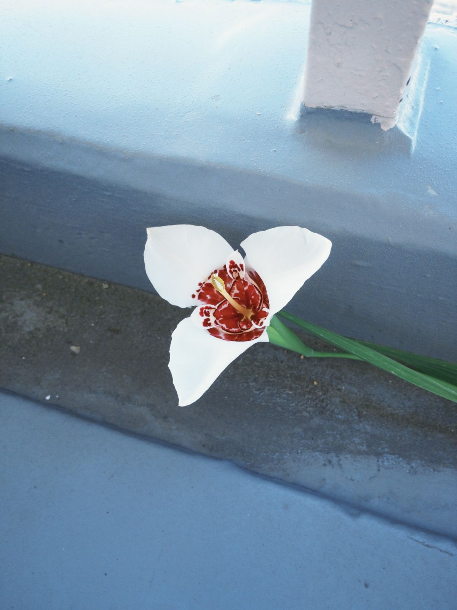

#### 博客和电子玩具

- 最近这个月一口气更了好多篇大博客……我这一阵一阵的倾诉欲！不过吐得也差不多了，好像暂时没有特别想写的选题了，可能接下来又会安静一阵子，回到只更月总结的日子吧……数了数更了大概以下几篇（点击下方标题即可跳转）：
	- [《箱根！箱根！》](../post-32)
	- [《卷毛羊版开源节流ver2026》](../post-33)
	- [《家居好物分享（二）》](../post-34)
	- [《如何在博客里随机显示嘟文》](../post-35)
	- [《卷毛羊的多图博文工作流程》](../post-36)
	- [《如何大量生产大博客？》](../post-37)
	- [《赛博羊圈是怎么搭起来的？》](../post-38)
	- [《2026上半年状态总结》](../post-39)
	- [《赛博羊圈都是怎么装修的？》](../post-40)
	- [《Obsidian记录大一统》](../post-41)
- 装修也装修得很起劲，各种大大小小的功能，设计上的改动，代码的优化……辗转于各个AI之间用尽了免费额度，最后还是没忍住开了copilot和claude的会员……！不过前者感觉不是很好用，除了便宜一无是处，已经取消了订阅，打算等这个月的用完就不再续了，专注用Claude。
- 还vibe coding了一个misskey的嘟文存档查看网站，好玩！没想到做起来这么简单，只要指挥几句就好。
- 噢对没发博客但是应铃师傅邀请发嘟列了一下觉得好喝的茶叶！
- 想起来自己用的记账软件cashew是开源的，也买了终身会员，感觉都挺好用的！但就是之前提过一个意见但是一直迟迟没有回复，心想好像可以用克老师来做，于是就把代码克隆下来动手了，还装成功了！主要是把月度预算的开始日设置成我的发薪日，因为发薪日是休息日的话会自动前移到前一个工作日，原来的cashew是定死的日期不会根据日本节假日或者周末调整，现在让克老师给我加了个灵活调整的按钮，预算总算不会跟工资发放周期错位了……！一下子感觉舒服了很多！后续可能想到什么功能会再加吧。
- 用扩展程序把煤炉买卖数据导出成csv，然后让克老师给我整理统计了一下，整合到obsdian里来了……总算不用再手动统计了，解放双手！
- 本来还想做各个平台的point自动统计，但是让克老师给我调查了一下发现数据大部分都要手动导出获取，费劲程度不亚于我自己手动统计……于是果断放弃了。
- 用chrome扩展程序版的克老师写了个bookmarklet，一键搜索自己发的运动嘟嘟，这样每天运动完就不用自己反复输入查找了！省力！
- 顺便给小张博客也装修了一下，删除了不用的页面，调整了首页图片的尺寸和余白，顺便把日志从精选改成了抓取最新三条，加上了面包屑导航和输入页码跳转的功能，升级了一下astro，追加了测试……又弄了一下SEO，现在谷歌日文检索游戏名，搜索结果也会出现他博客了。
- 有一部分家务肉眼看不太出来脏没脏，需要记住上次做的时间，隔得比较久了再考虑做一次……很久以前我是用白板来解决这个问题的，搬家后白板就扔了，后面换了手机待办清单/备忘录/obsidian手帐来记，效果都不是很好，不是忘记记录，就是记完了忘记看也就忘记做这个家务……跟克老师商量了一下，把记录改成了快捷指令，这样只要选择然后更新日期就可以。导出来的家务项目和日期就写成个json文件，让克老师给我写了个脚本在scriptable上跑，做成了一个可视化的小组件，放在手机上，这样就可以比较直观地看到各项家务都是什么时候做的了。而我手机又是基本上不离手的，平常看个日历或者查个地图就能瞟到家务的这个组件，也不会忘记。
- 整理了一下自己的收集工具现状，大概是像下图这样，能自动化或部分自动化的都自动化了，除了浏览器书签还没整理之外，其他的也都整理过几回了，对现状还是比较满意的！

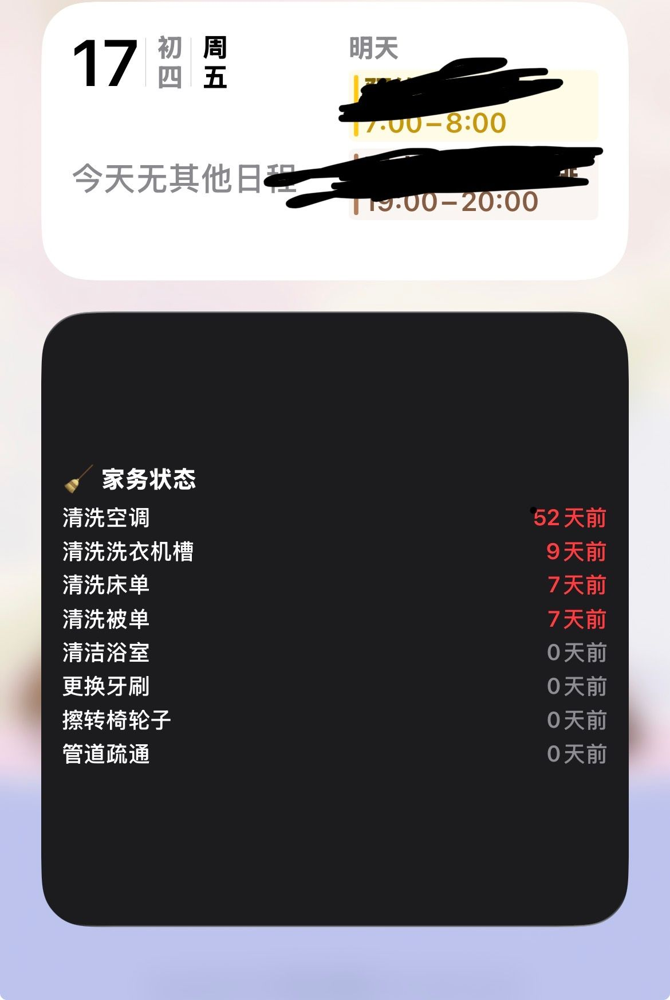

- 目前电脑上运行了三个自动化脚本（定期抓取misskey嘟文/misskey收藏/手机账单自动同步），但没解决脚本运行失败后的通知问题。后面在手机上装了Bark这个app，让克老师帮我改成脚本运行失败后给我发通知，这样就不会抓取/同步失败好久都发现不了了……！
- 下载了Hammerspoon，跟克老师磨合了很久，终于调整出来几个比较常用的分屏方案。顺便加了个剪藏的功能，选中文字后可以帮我把来源网址和原文一起存进指定的obsidian文件夹里，可以适用在刷fedi以外的场景……！

#### 家居生活

- 查了有什么展会可以去，把几个想去的都写进了自己的日历里。
- 用上了新买回来的本子做拼贴，玩得很开心，就是双面胶用着不太顺手，新购入了点点胶！果然不错！感觉更有动力玩了！
- 看蒜蒜的视频种草了按压式的洗衣液，搜了一下花王的attack zero就是这样的使用方式，打算等手头囤的洗衣粉都用完就买回来试试。
- 换下了日本七夕和绣球的装饰，拿出了看上去像是普通夏天的明信片。

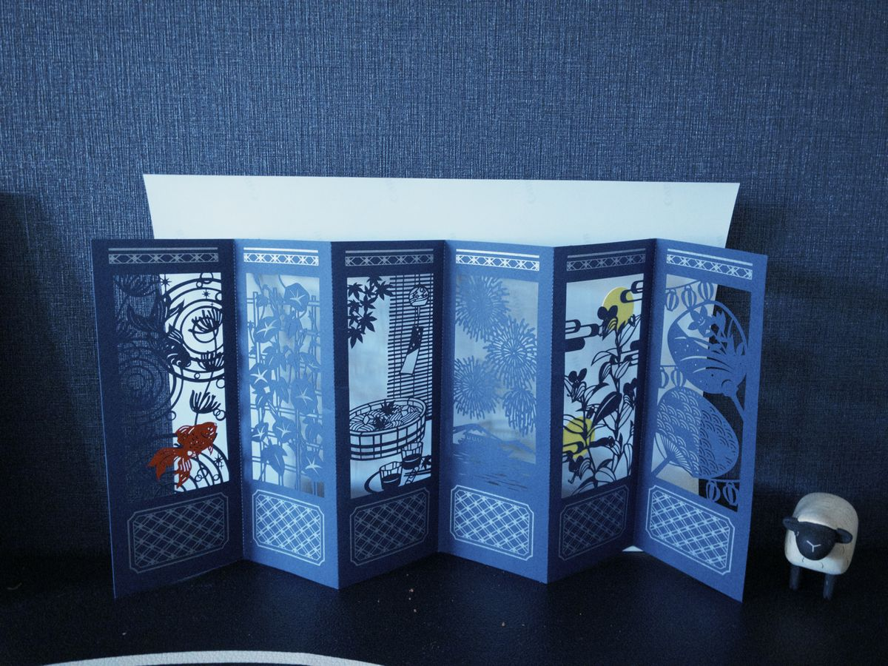

- 换下了床头的海报。

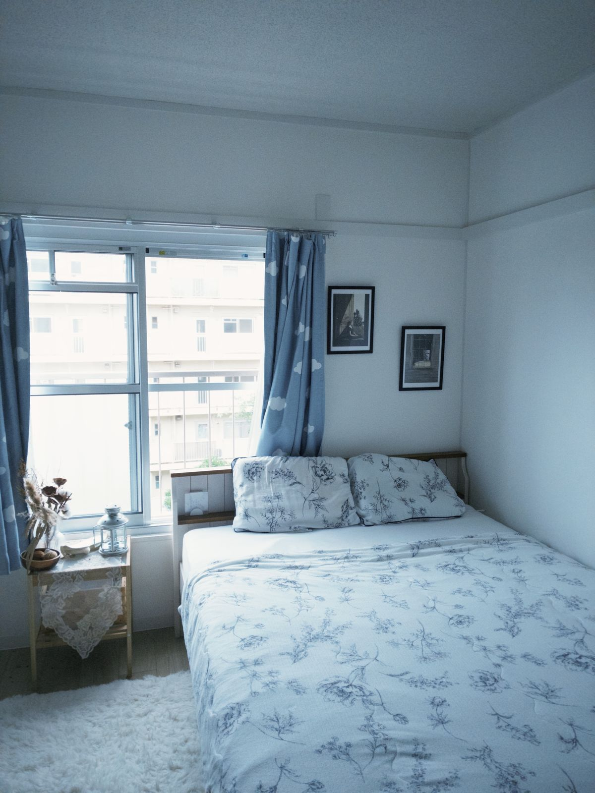

- 真喜欢我家啊……美美欣赏……

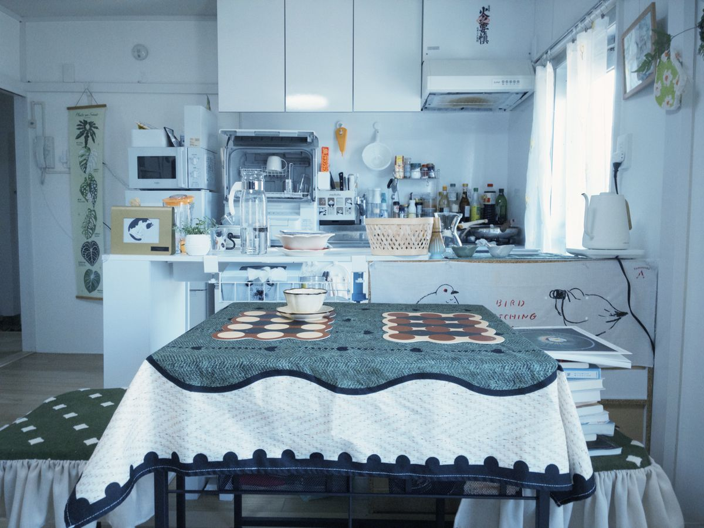

- 处理了沉迷大博客期间忘做的很多琐碎家务……
- 打印了近一个月的照片，整理相册，把总数控制在了八千左右……感觉理想数字就是一万以下了，再多的我可能就不会看了。
- 用キッチンハイター擦了擦我的白色鼠标，浅层的皮脂垢直接就擦下来了，感觉比起之前干净了不少。那些已经染色变黄的部分好像就没有办法了……不过我已经很满意了。
- 这个月的插花，不是很多～

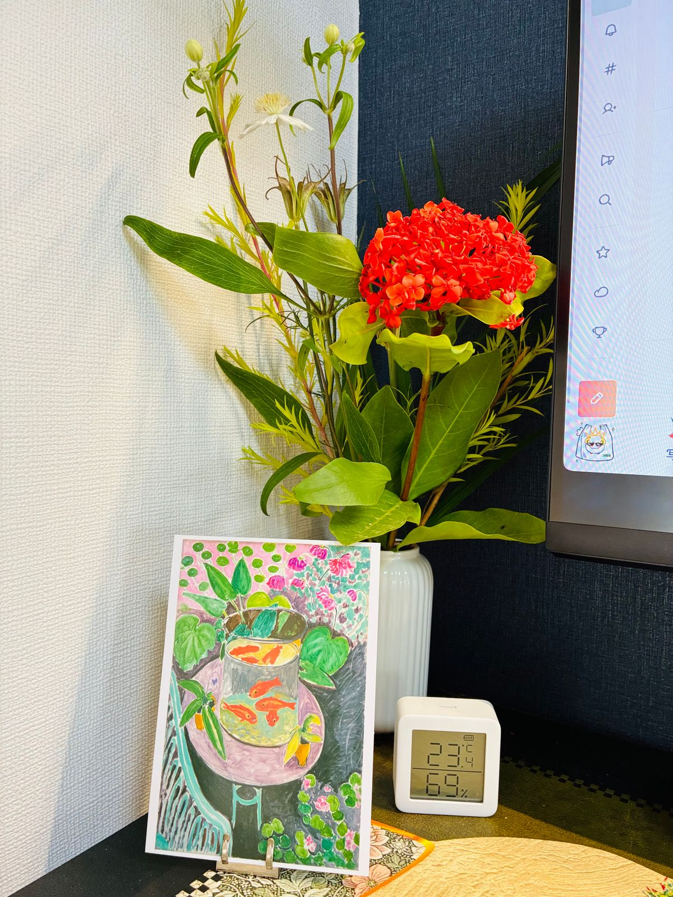

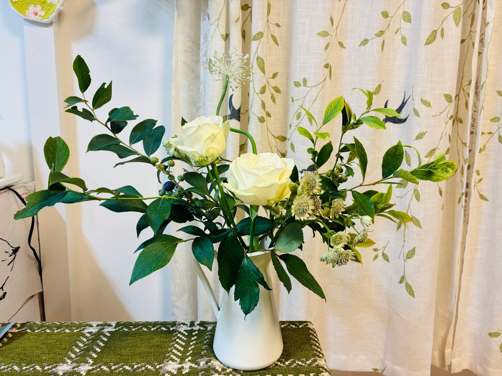

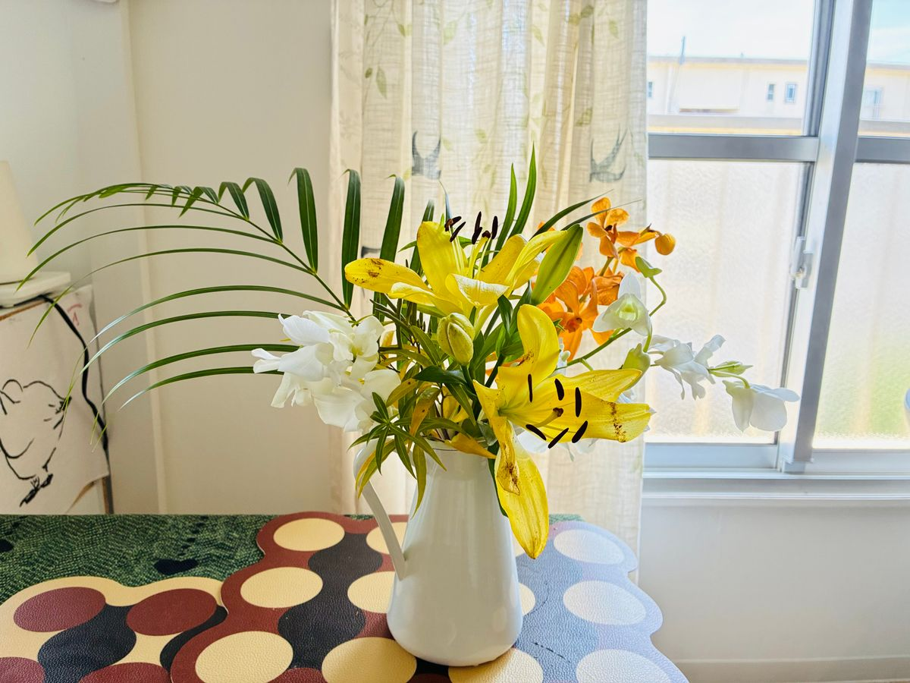

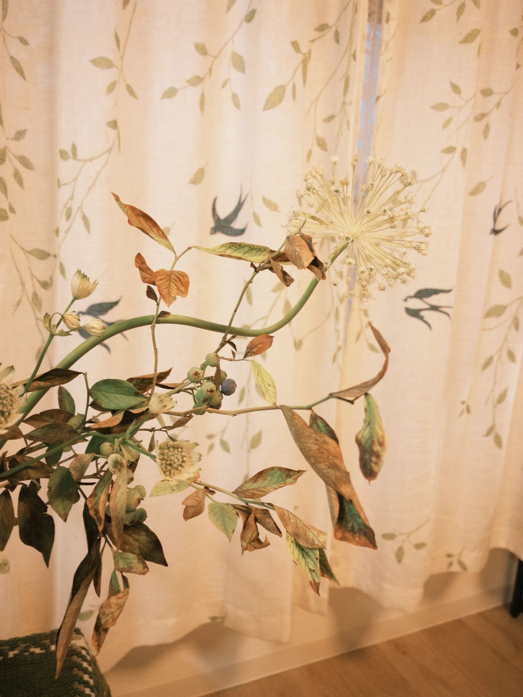

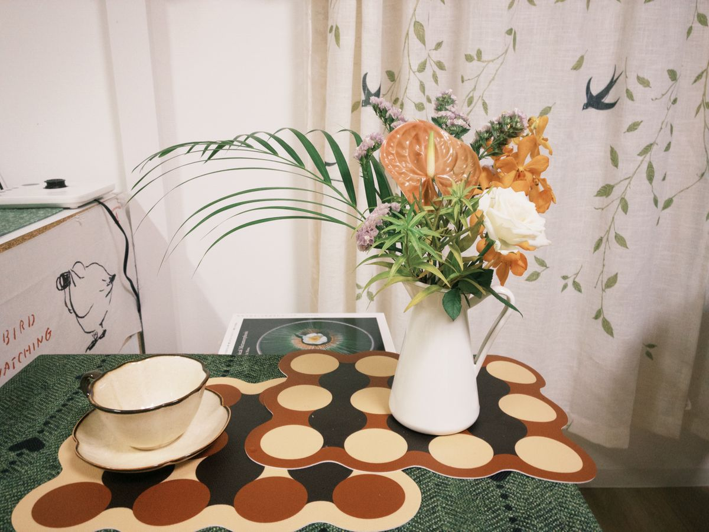

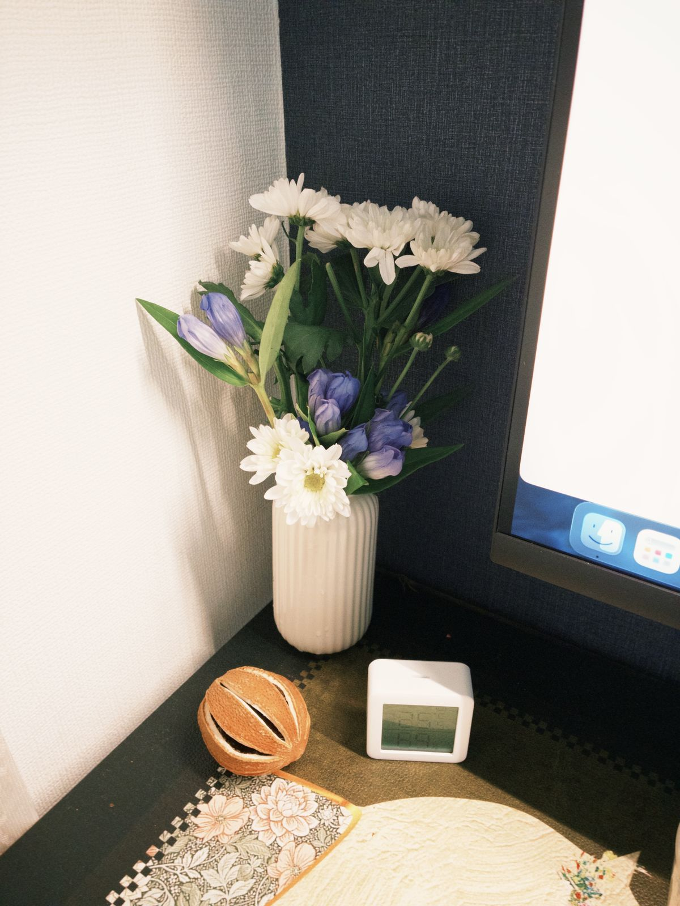

#### 手帐

- 详见大博客[《Obsidian记录大一统》](../post-41)，总之这个月做了一堆事情，把大部分电子记录都统一聚合到obsidian里面来了！
- 博客里没讲到的稍微记一下：给obsidian装了claudian的插件，用这个就可以比较轻松选中某篇或者某段笔记让claude直接给我改，不用再在客户端里指定，稍微方便了一点。现在的用法主要是帮我调整格式/功能/主题，偶尔会选中当天的食物摄入或者这一周的食物摄入记录，让claude给我分析一下，看有没有缺哪方面的营养。
- 重新换了obsidian的主题，看上去颜色更丰富了一点，标题和表格也更方便看了。就是宽度和hover的效果不太符合我的需求，让克老师给我改了一下。顺便装了image toolkit，阻止了聚合页照片墙点击某张照片之后自动给我打开浏览器新标签页跳转到图片链接的行为……现在单击照片墙的照片的话，会在obsdian的当前页面放大，点击overlay就会关闭，方便了很多。
- 装了heatmap tracker这个插件，在聚合页做了个日历图，手帐们都按字数统计分成不同颜色显示，可以比较直观看到最近的表达欲是否旺盛，还有手帐的空窗期，比较方便我把握郁期的发生频率和持续时间以及最近的状态。
- 让克老师改了改嘟文抓取的脚本，把mastodon和misskey的收藏夹里的嘟文一起同步到了obsidian上，又整理回顾了一下。加了个自动化，让misskey的收藏夹嘟文抓取脚本每个月1号运行一次，我就不用手动去运行了。
- 看到夏夏和塔塔的推荐，给obsidian装了Notebook Navigator这个插件！可以固定笔记和快捷访问感觉还挺方便的，功能也很丰富，正在快乐探索中。

#### 收支计划

- 调整了记账app的设置，然后清理了一下手机空间，把icloud的套餐从450日元200g的换成了150日元50g的。
- 重新算了一遍追缴国民年金划算不划算，得出来的结果还是不划算……打算放弃了！反正我也没有这么一大笔钱追缴，就算有也想花在别的地方或者干脆投进nisa。
- 用扩展程序导出了煤炉的交易记录，统计了一下，发现今年上半年净收益有5万日元……！我爱回血！当然扣掉的只有手续费和运费，没有考虑卖出的那样东西我原来买的时候是多少钱。不过既然决定卖了就是不会再用到了，相比一直放在家里吃灰来说还是要赚的！
- 跟师姐和皮皮凑了一波集运，祈祷东西快快送到。

回顾完过去一个月觉得真是难得的精力充沛……真想一直这么下去啊！

