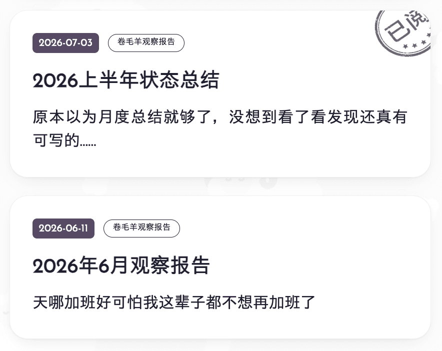

<p class='foreword my-3'>起初是看夏夏翻友链装修日志找一键copy代码没翻到，感觉自己博客可以写写这方面的内容，于是就有了这篇博文！又临时凑了几个加在一起，所以这篇文章大概没什么文字，纯粹是一个羊圈装修用代码仓库，大家喜欢搬走就可以了！</p>

<div class="divider mb-3 mx-auto"></div>

### 一键copy代码

#### 效果

```
testtesttest
```

#### 代码（js）

```javascript
  // 复制按钮用到的两个图标（复制中 / 已复制），内联 SVG 免得额外发请求
  const ICON_COPY = `<svg viewBox="0 0 24 24" fill="none" stroke="currentColor" stroke-width="2" stroke-linecap="round" stroke-linejoin="round" aria-hidden="true"><rect x="9" y="9" width="11" height="11" rx="2"/><path d="M5 15V5a2 2 0 0 1 2-2h8"/></svg>`;
  const ICON_DONE = `<svg viewBox="0 0 24 24" fill="none" stroke="currentColor" stroke-width="2.4" stroke-linecap="round" stroke-linejoin="round" aria-hidden="true"><path d="M20 6 9 17l-5-5"/></svg>`;

  function writeClipboard(text: string): Promise<void> {
    if (navigator.clipboard && window.isSecureContext) {
      return navigator.clipboard.writeText(text);
    }
    // 兜底：http 或者不支持 Clipboard API 的旧浏览器
    return new Promise((resolve, reject) => {
      const ta = document.createElement('textarea');
      ta.value = text;
      ta.style.cssText = 'position:fixed;top:-9999px;opacity:0';
      document.body.appendChild(ta);
      ta.select();
      const ok = document.execCommand('copy');
      ta.remove();
      ok ? resolve() : reject(new Error('execCommand failed'));
    });
  }

  // 查找所有代码块，给每个都加个复制按钮
  function initCopyButtons() {
    document.querySelectorAll<HTMLPreElement>('.prose pre').forEach((pre) => {
      // 已经处理过就跳过（保险起见，避免重复插入）
      if (pre.closest('.code-wrapper[data-copy]')) return;

      // Astro 内置的 Shiki 高亮直接输出 <pre>，不带外层包装容器，
      // 这里自己包一层，好让按钮用 position:absolute 相对这层定位
      const wrapper = document.createElement('div');
      pre.parentNode?.insertBefore(wrapper, pre);
      wrapper.appendChild(pre);
      wrapper.classList.add('code-wrapper');
      wrapper.dataset.copy = 'true';

      const button = document.createElement('button');
      button.type = 'button';
      button.className = 'copy-code-button';
      button.setAttribute('aria-label', '复制代码');
      button.innerHTML = `${ICON_COPY}<span>Copy</span>`;
      wrapper.appendChild(button);

      const code = pre.querySelector('code') ?? pre;
      let timer: ReturnType<typeof setTimeout>;

      button.addEventListener('click', async () => {
        try {
          await writeClipboard((code as HTMLElement).innerText.replace(/\n$/, ''));
          button.classList.add('is-copied');
          button.innerHTML = `${ICON_DONE}<span>Copied</span>`;
          clearTimeout(timer);
          timer = setTimeout(() => {
            button.classList.remove('is-copied');
            button.innerHTML = `${ICON_COPY}<span>Copy</span>`;
          }, 1600);
        } catch (err) {
          console.error('Copy failed!', err);
          button.innerHTML = `${ICON_COPY}<span>Failed</span>`;
        }
      });
    });
  }

  initCopyButtons();
```

#### 代码（css）

```css
 /* =========================================================
     代码块「复制」按钮样式
     配套 JS：给每个 pre 外面套一层 .code-wrapper，
     并在里面插入一个 .copy-code-button

     没有做浅色主题适配
     ========================================================= */

  /* ---------- 1. 定位容器 ---------- */

  :global(.code-wrapper) {
    position: relative;
    /* 给按钮提供绝对定位的坐标原点，没有这行按钮会飞到页面角落 */
  }

  :global(.code-wrapper > pre) {
    padding-top: 1.5em;
    /* 代码区顶部留白，防止按钮压住第一行代码 */
  }

  /* ---------- 2. 按钮本体 ---------- */

  :global(.copy-code-button) {
    position: absolute;
    /* 脱离文档流，相对 .code-wrapper 定位 */
    top: 0.6em;
    /* 距代码块顶边的距离 */
    left: 0.6em;
    /* 距代码块左边的距离（改成 right 即可放到右上角） */
    z-index: 2;
    /* 层级抬高，压在代码内容之上，避免被遮住 */

    display: inline-flex;
    /* 弹性布局，让图标和文字能并排且垂直居中 */
    align-items: center;
    /* 图标与文字在竖直方向对齐居中 */
    gap: 0.4em;
    /* 图标和文字之间的间距 */

    margin: 0;
    /* 清掉浏览器给 button 的默认外边距 */
    padding: 0.32em 0.7em;
    /* 按钮内边距：上下 0.32em，左右 0.7em，决定按钮大小 */

    font: inherit;
    /* 继承页面字体，覆盖 button 默认的系统字体 */
    font-size: 0.75rem;
    /* 按钮文字大小（图标尺寸不受影响，单独设） */
    font-weight: 500;
    /* 字重，中等粗细，比正文略突出一点 */
    line-height: 1.4;
    /* 行高，影响按钮的实际高度 */
    letter-spacing: 0.01em;
    /* 字间距，微微拉开一点更清爽 */
    color: rgba(255, 255, 255, 0.62);
    /* 文字和图标颜色（图标用 currentColor 跟随此值） */

    background: rgba(255, 255, 255, 0.06);
    /* 按钮底色：极淡的白，浮在深色代码块上 */
    border: 1px solid rgba(255, 255, 255, 0.1);
    /* 1px 细描边，勾出按钮轮廓 */
    border-radius: 7px;
    /* 圆角大小，数值越大越圆 */
    backdrop-filter: blur(6px);
    /* 毛玻璃效果：模糊按钮背后的代码 */
    -webkit-backdrop-filter: blur(6px);
    /* 同上，Safari 需要的私有前缀 */

    cursor: pointer;
    /* 鼠标移上去变成小手，提示可点击 */
    opacity: 0;
    /* 默认完全透明（即隐藏），悬停代码块时才显形 */
    transform: translateY(-2px);
    /* 默认向上偏移 2px，配合淡入做「滑下来」的动效 */
    transition:
      opacity 0.18s ease,
      /* 显隐的淡入淡出时长 */ transform 0.18s ease,
      /* 位移／缩放的过渡时长 */ color 0.18s ease,
      /* 文字变色的过渡 */ background-color 0.18s ease,
      /* 底色变化的过渡 */ border-color 0.18s ease;
    /* 描边变色的过渡 */
  }

  :global(.copy-code-button svg) {
    width: 13px;
    /* 图标宽度 */
    height: 13px;
    /* 图标高度 */
    flex: none;
    /* 禁止图标被弹性布局压扁或拉伸 */
  }

  /* ---------- 3. 显形时机：悬停代码块、键盘聚焦、复制成功后 ---------- */

  :global(.code-wrapper:hover .copy-code-button),
  /* 鼠标移到代码块任意位置时 */
  :global(.copy-code-button:focus-visible),
  /* 用 Tab 键聚焦到按钮时（无障碍） */
  :global(.copy-code-button.is-copied) {
    /* 刚复制完、正显示 Copied 时保持可见 */
    opacity: 1;
    /* 完全不透明，按钮出现 */
    transform: translateY(0);
    /* 回到原位，完成下滑动画 */
  }

  /* ---------- 4. 交互状态 ---------- */

  :global(.copy-code-button:hover) {
    color: rgba(255, 255, 255, 0.95);
    /* 悬停时文字变亮，反馈「可以点了」 */
    background: rgba(255, 255, 255, 0.12);
    /* 悬停时底色加深一点 */
    border-color: rgba(255, 255, 255, 0.2);
    /* 悬停时描边变明显 */
  }

  :global(.copy-code-button:active) {
    transform: scale(0.96);
    /* 按下瞬间轻微缩小，做出「按下去」的手感 */
  }

  :global(.copy-code-button:focus-visible) {
    outline: 2px solid rgba(120, 170, 255, 0.55);
    /* 键盘聚焦时的蓝色 focus 环（鼠标点击不会触发） */
    outline-offset: 2px;
    /* focus 环与按钮边缘的间隙 */
  }

  :global(.copy-code-button.is-copied) {
    color: #4ade80;
    /* 复制成功后文字和对勾图标变绿 */
    background: rgba(74, 222, 128, 0.12);
    /* 成功态的淡绿底色 */
    border-color: rgba(74, 222, 128, 0.32);
    /* 成功态的绿色描边 */
  }

  /* ---------- 5. 触屏设备适配 ---------- */

  @media (hover: none) {
    /* 手机／平板等没有鼠标悬停的设备 */
    :global(.copy-code-button) {
      opacity: 1;
      /* 按钮常驻显示，否则触屏用户永远看不到它 */
      transform: none;
      /* 取消位移动画，直接停在最终位置 */
    }
  }
```

### 阅读进度条代码

效果展示略过，正在看这篇文章的时候估计就已经显示在大家屏幕/浏览器的顶部了。

#### 代码

```html
<div id="progress-bar"></div>

<style>
  #progress-bar {
    position: fixed;
    top: 0;
    left: 0;
    height: 3px;
    width: 0%;
    background: #375a7f; /* 换成你想要的颜色 */
    z-index: 2000;
    transition: width 0.1s ease;
  }
</style>

<script>
  function updateProgressBar() {
    var bar = document.getElementById('progress-bar');
    if (!bar) return;

    var scrollTop = window.scrollY;
    var docHeight = document.documentElement.scrollHeight - window.innerHeight;
    var percent = docHeight > 0 ? (scrollTop / docHeight) * 100 : 0;
    bar.style.width = percent + '%';
  }

  document.addEventListener('DOMContentLoaded', function () {
    updateProgressBar(); // 页面刚加载时先校正一次（比如从锚点直接跳到页面中间打开的情况）
    window.addEventListener('scroll', updateProgressBar);
  });
</script>
```

### 菜单栏按钮鼠标移动至上方时出现下划线

效果也省略了，可以直接参考电脑端鼠标移动到菜单栏按钮时的效果。
其中.navbar__title, .navbar__menu, #search-container 是羊圈的菜单栏标题、菜单项、搜索框的类名，大家可以根据自己博客的实际情况修改。

#### 代码

```css
.navbar__title>a::after,
.navbar__menu>a::after,
#search-container::after {
  content: '';
  position: absolute;
  left: 0;
  right: 0;
  bottom: -4px;
  height: 2px;
  background-color: var(--underline);
  transform: scaleX(0);
  transform-origin: center;
  transition: transform 0.3s ease;
}

.navbar__title>a:hover::after,
.navbar__menu>a:hover::after,
#search-container:hover::after,
.navbar__menu>a:focus-visible::after,
.navbar__title>a.is-pressed::after,
.navbar__menu>a.is-pressed::after,
.navbar__title>a.active::after,
.navbar__menu>a.active::after {
  transform: scaleX(1);
}
```

### 博文卡片上的已阅小印章

#### 效果

懒得引用了，还要改数据……放张效果图好了。想知道具体操作起来是什么样的话，可以菜单栏点击Posts或者Tags，回到文章卡片列表页，点几个玩玩看。



#### 代码（文章列表页）

```html
<ul class="post-list">
  <li>
    <a class="post-card" href="/posts/post-1.html" data-post-slug="post-1">
      <div class="post-card-meta">
        <time class="post-date">2026-01-01</time>
      </div>
      <h3 class="post-title">示例文章标题</h3>
      <p class="post-desc">这是一段示例简介。</p>
      <!-- 已读图章：默认藏起来，JS 判断这篇文章读过之后才会显示 -->
      <span class="read-stamp" aria-hidden="true">
        
      </span>
    </a>
  </li>
  <!-- 更多 <li> 照抄这个结构就行 -->
</ul>

<style>
  .post-list {
    list-style: none;
    margin: 1.5rem 0 0;
    padding: 0;
    display: flex;
    flex-direction: column;
    gap: 1rem;
  }

  .post-card {
    position: relative; /* 已读图章要相对这个卡片做绝对定位 */
    overflow: hidden; /* 图章旋转后一部分会探出卡片边缘，裁掉 */
    display: block;
    padding: 1.25rem;
    border-radius: 1rem;
    border: 1px solid #e5e5e5; /* 换成你自己的边框色 */
    background-color: rgba(255, 255, 255, 0.8); /* 换成你自己的卡片底色 */
    text-decoration: none;
    color: inherit;
    transition: transform 0.3s ease-in-out;
  }

  /* 鼠标悬停 / 手指按下时卡片轻轻上浮，做出"可以点"的反馈 */
  .post-card:hover,
  .post-card.is-pressed {
    transform: translateY(-10px);
  }

  .post-date {
    font-size: 0.875rem;
    color: #888;
  }

  .post-title {
    margin: 0.5rem 0 0;
    font-size: 1.125rem;
    font-weight: 600;
  }

  .post-desc {
    margin: 0.5rem 0 0;
    font-size: 0.875rem;
    line-height: 1.6;
    color: #555;
  }

  /* 图源裁掉透明边之后是 180x163（按展示尺寸 90px 的 2 倍图导出，兼顾高分屏），
     用 aspect-ratio 锁住这个真实比例，宽度定死、高度跟着比例走，避免图章被拉伸变形。 */
  .read-stamp {
    position: absolute;
    top: -19px;
    right: -15px;
    width: 90px;
    aspect-ratio: 180 / 163;
    transform: rotate(-12deg) scale(0.85);
    opacity: 0;
    pointer-events: none;
    transition: opacity 0.2s ease, transform 0.2s ease;
  }

  .read-stamp img {
    width: 100%;
    height: 100%;
    display: block;
  }

  /* 卡片一旦被 JS 加上 .is-read，图章就淡入 + 转正到最终角度和大小 */
  .post-card.is-read .read-stamp {
    opacity: 0.92;
    transform: rotate(-12deg) scale(1);
  }

  @media (prefers-reduced-motion: reduce) {
    .post-card,
    .read-stamp {
      transition: none;
    }
  }
</style>

<script>
  // ---------- 1. 已读状态存取：全部放一个 localStorage key 里 ----------
  // 用 { slug: 已读时间戳 } 这样一个对象存所有已读记录，而不是一篇文章一个
  // key，方便列表页一次性读出全部已读 slug。
  var STORAGE_KEY = 'read-posts';

  function readStore() {
    try {
      var raw = localStorage.getItem(STORAGE_KEY);
      return raw ? JSON.parse(raw) : {};
      // 隐私浏览模式下 localStorage 可能直接抛异常（Safari 历史上就是这样），
      // 读失败就当没有任何已读记录，不影响正常浏览。
    } catch (e) {
      return {};
    }
  }

  function getReadSlugs() {
    return Object.keys(readStore());
  }

  // ---------- 2. 给每张卡片标记已读/未读 ----------
  function markReadCards() {
    var readSlugs = getReadSlugs();
    document.querySelectorAll('.post-card').forEach(function (card) {
      var slug = card.dataset.postSlug;
      var isRead = slug && readSlugs.indexOf(slug) !== -1;
      card.classList.toggle('is-read', !!isRead);
    });
  }

  // ---------- 3. 按下时的视觉反馈（鼠标和触屏通用） ----------
  function attachPressFeedback() {
    document.querySelectorAll('.post-card').forEach(function (card) {
      var press = function () { card.classList.add('is-pressed'); };
      var release = function () { card.classList.remove('is-pressed'); };
      card.addEventListener('pointerdown', press);
      card.addEventListener('pointerup', release);
      card.addEventListener('pointerleave', release);
      card.addEventListener('pointercancel', release);
    });
  }

  document.addEventListener('DOMContentLoaded', function () {
    markReadCards();
    attachPressFeedback();
  });
</script>
```

#### 代码（文章详情页）

```html
<script>
  (function () {
    var STORAGE_KEY = 'read-posts';
    // 每篇详情页页面自己填当前这篇文章的 slug（跟列表页 data-post-slug 对应上）
    var currentSlug = 'post-1';

    try {
      var raw = localStorage.getItem(STORAGE_KEY);
      var store = raw ? JSON.parse(raw) : {};
      if (!store[currentSlug]) {
        store[currentSlug] = Date.now();
        localStorage.setItem(STORAGE_KEY, JSON.stringify(store));
      }
    } catch (e) {
      // 忽略：多半是隐私浏览模式下 localStorage 不可写，不影响正常阅读
    }
  })();
</script>
```

### 博文卡片的悬浮动画效果

#### 效果

<div class="my-6">
  <a
    href="#"
    class="block rounded-2xl border border-gray-200 bg-white/80 p-5 text-inherit no-underline transition duration-300 ease-in-out hover:-translate-y-2.5 active:-translate-y-2.5 motion-reduce:transition-none"
  >
    <time class="text-sm text-gray-500">2026-01-01</time>
    <h3 class="mt-2 text-lg font-semibold">鼠标移上来试试</h3>
    <p class="mt-2 text-sm leading-6 text-gray-600">卡片会往上浮起来一点，移开又会回到原位。</p>
  </a>
</div>

#### 代码

```html
<div class="hover-lift-demo">
  <a class="demo-card" href="#">
    <time class="demo-date">2026-01-01</time>
    <h3 class="demo-title">鼠标移上来试试</h3>
    <p class="demo-desc">卡片会往上浮起来一点，移开又会回到原位。</p>
  </a>
</div>

<style>
  .demo-card {
    display: block;
    padding: 1.25rem;
    border-radius: 1rem;
    border: 1px solid #e5e5e5; /* 换成你自己喜欢的边框色 */
    background-color: rgba(255, 255, 255, 0.8); /* 换成你自己的卡片底色 */
    text-decoration: none;
    color: inherit;

    /* 核心效果就这一行：告诉浏览器 transform 属性发生变化的时候，
       用 0.3 秒时间、ease-in-out 的缓动曲线做平滑过渡，
       而不是瞬间跳过去。少了这一行，下面的位移会变成"哐"一下瞬移。 */
    transition: transform 0.3s ease-in-out;
  }

  /* 鼠标悬停时往上位移 10px（原来 Tailwind 写的是 -translate-y-2.5，
     Tailwind 一个间距单位是 0.25rem = 4px，2.5 个单位换算出来就是 10px）。
     故意用 transform 而不是改 margin-top 或者 top，是因为 transform
     不会触发浏览器重新计算页面布局（reflow），改起来更流畅、不卡顿，
     这也是做这类"悬浮"动效时的标准做法。 */
  .demo-card:hover {
    transform: translateY(-10px);
  }

  /* 触屏设备没有真正意义上的"鼠标悬停"，手指点下去的瞬间触发的是
     :active 而不是 :hover，所以这里也单独绑一份同样的效果，
     保证触屏用户点一下也能看到反馈，不是只有用鼠标的人才有动效。 */
  .demo-card:active {
    transform: translateY(-10px);
  }

  .demo-date {
    font-size: 0.875rem;
    color: #888;
  }

  .demo-title {
    margin: 0.5rem 0 0;
    font-size: 1.125rem;
    font-weight: 600;
  }

  .demo-desc {
    margin: 0.5rem 0 0;
    font-size: 0.875rem;
    line-height: 1.6;
    color: #555;
  }

  /* 尊重"减少动态效果"这项系统设置——有些人因为前庭功能等原因
     不希望页面出现位移/缩放类动画，检测到这个设置就直接关掉过渡，
     卡片还是会上浮，只是不再有"滑动"的过程，瞬间到位。 */
  @media (prefers-reduced-motion: reduce) {
    .demo-card {
      transition: none;
    }
  }
</style>
```


<div class="divider my-3 mx-auto"></div>
<p class='foreword'>我能想起来的大概就是这么多啦！还有什么想看的可以随时嘟嘟跟我说，或者评论区留言！尽量有求必应嘿嘿。</p>